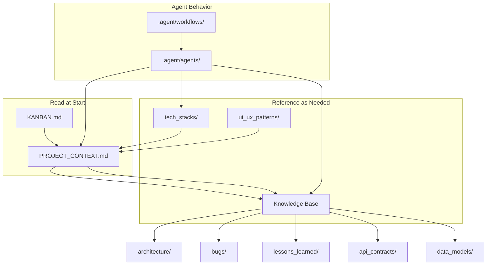

# 🧠 CONTEXT ENGINE - Shared Context Management Protocol
<!-- VI: Engine quản lý ngữ cảnh chia sẻ giữa các agent và phiên làm việc -->

> **PURPOSE**: Define how context is structured, shared, and persisted across agents and sessions.
> This solves the "goldfish memory" problem when switching chat windows.

---

## 📊 CONTEXT HIERARCHY

<!-- VI: Phân cấp ngữ cảnh từ ngắn hạn → dài hạn -->

```
┌────────────────────────────────────────┐
│ LAYER 1: IMMEDIATE CONTEXT (Session)   │ ← Current chat window
│ - Current task being worked on         │
│ - Open files and recent changes        │
│ - Conversation history (in tokens)     │
├────────────────────────────────────────┤
│ LAYER 2: SESSION CONTEXT (Persistent)  │ ← PROJECT_CONTEXT.md
│ - Active work summary                  │
│ - Decisions made this session          │
│ - Blockers encountered                 │
│ - Handover notes                       │
├────────────────────────────────────────┤
│ LAYER 3: PROJECT CONTEXT (Permanent)   │ ← Knowledge Base
│ - Architecture & tech stack            │
│ - API contracts & data models          │
│ - Bug history & resolutions            │
│ - Lessons learned                      │
├────────────────────────────────────────┤
│ LAYER 4: REFERENCE CONTEXT (Static)    │ ← Tech Stacks, Patterns
│ - Reference architectures              │
│ - UI/UX patterns & design systems      │
│ - Best practices & standards           │
└────────────────────────────────────────┘
```

---

## 🔄 CONTEXT LIFECYCLE

<!-- VI: Vòng đời của ngữ cảnh -->

### Session Start → Context Loading
```
SEQUENCE load_context:
    1. OPEN PROJECT_CONTEXT.md
       → Extract: project_overview, current_sprint, active_work, blockers
    
    2. OPEN KANBAN.md
       → Extract: in_progress_tasks, review_items, priorities
    
    3. SCAN .shared/knowledge_base/bugs/active/
       → Load active bug references
    
    4. READ .shared/knowledge_base/lessons_learned/GOTCHAS.md
       → Load project-specific gotchas
    
    5. IF task involves architecture:
       → LOAD .shared/knowledge_base/architecture/CURRENT_STATE.md
    
    6. IF task involves specific tech:
       → LOAD relevant file from .shared/tech_stacks/
    
    7. BUILD context_summary for agent
```

### During Session → Context Updates
```
SEQUENCE update_context:
    WHEN task_completed:
        → UPDATE KANBAN.md (move task)
        → APPEND to PROJECT_CONTEXT.md (completed items)
    
    WHEN decision_made:
        → APPEND to PROJECT_CONTEXT.md (decisions)
        → IF architecture_decision: CREATE ADR
    
    WHEN bug_found:
        → CREATE .shared/knowledge_base/bugs/active/BUG_{id}.md
        → UPDATE PROJECT_CONTEXT.md (active bugs)
    
    WHEN lesson_learned:
        → APPEND to appropriate file in lessons_learned/
    
    WHEN blocker_encountered:
        → UPDATE KANBAN.md (add blocker note)
        → UPDATE PROJECT_CONTEXT.md (blockers)
```

### Session End → Context Persistence
```
SEQUENCE persist_context:
    1. GENERATE session_summary:
       - Work completed
       - Decisions made
       - Files changed
       - Next steps
    
    2. UPDATE PROJECT_CONTEXT.md:
       - Handover Notes section
       - Recently Completed section
       - Active Work section
    
    3. VERIFY KANBAN.md accuracy:
       - All started tasks in "In Progress"
       - All completed tasks in "Done"
       - All reviews in "Review"
    
    4. COMMIT knowledge updates:
       - New bugs logged
       - Lessons documented
       - ADRs created
    
    5. CONFIRM to user: "Context saved. Ready for handover."
```

---

## 📁 CONTEXT FILE SPECIFICATIONS

<!-- VI: Đặc tả các file ngữ cảnh -->

### PROJECT_CONTEXT.md
```yaml
purpose: Single source of truth for current project state
updated_by: All agents (after significant actions)
read_by: All agents (at session start)
sections:
  - Project Overview (rarely changes)
  - Current Architecture (changes with major decisions)
  - Tech Stack Selected (changes when adding tech)
  - Current Sprint (changes each sprint)
  - Active Work (changes frequently)
  - Recently Completed (append only)
  - Active Bugs (changes with bug lifecycle)
  - Key Decisions (append only)
  - Lessons Learned Recent (append, archive old)
  - Handover Notes (overwritten each session)
```

### KANBAN.md
```yaml
purpose: Visual task tracking board
updated_by: All agents (when task status changes)
read_by: All agents (to understand current work)
columns:
  - BACKLOG: Items not yet scheduled
  - TODO: Items for current sprint
  - IN PROGRESS: Currently being worked (WIP limit: 3)
  - REVIEW: Awaiting review
  - TESTING: Under test
  - DONE: Completed this sprint
```

### SESSION_LOG.md (Template)
```yaml
purpose: Detailed log of single session (temporary)
created: Each session start
archived: After successful handover
contents:
  - Timestamp and agent info
  - Context loaded
  - Actions performed (with timestamps)
  - Decisions made with rationale
  - Blockers and resolutions
  - Files modified
  - Handover notes
```

---

## 🔗 CONTEXT RELATIONSHIPS

<!-- VI: Mối quan hệ giữa các file ngữ cảnh -->



---

## 📝 CONTEXT TEMPLATES

### Bug Entry Template
```markdown
# BUG-{ID}: {Title}

## Metadata
| Field | Value |
|-------|-------|
| Status | 🔴 Active / 🟡 Investigating / 🟢 Resolved |
| Severity | Critical / High / Medium / Low |
| Reported | {Date} |
| Assigned | {Agent} |
| Resolved | {Date if resolved} |

## Description
{Detailed description}

## Steps to Reproduce
1. {Step 1}
2. {Step 2}
3. {Step 3}

## Expected vs Actual
- **Expected**: {What should happen}
- **Actual**: {What actually happens}

## Root Cause Analysis
{After investigation - why did this happen?}

## Solution Applied
{Code changes, config changes, etc.}

## Lessons Learned
{What we learned to prevent this in future}

## Related Files
- {file1.ts}
- {file2.ts}
```

### ADR (Architecture Decision Record) Template
```markdown
# ADR-{ID}: {Decision Title}

## Status
Proposed / Accepted / Deprecated / Superseded by ADR-{X}

## Context
{What is the issue we're seeing that motivates this decision?}

## Decision
{What is the change we're proposing/making?}

## Consequences
### Positive
- {Benefit 1}
- {Benefit 2}

### Negative
- {Drawback 1}
- {Drawback 2}

### Neutral
- {Observation 1}

## Alternatives Considered
1. {Alternative 1}: {Why rejected}
2. {Alternative 2}: {Why rejected}
```

---

## ⚠️ CONTEXT RULES (STRICT)

<!-- VI: Quy tắc bắt buộc về quản lý ngữ cảnh -->

```yaml
mandatory_rules:
  read_before_work:
    - PROJECT_CONTEXT.md: ALWAYS
    - KANBAN.md: ALWAYS
    - Active bugs: IF debugging
    - Tech stack: IF making tech decisions
    
  update_after_work:
    - PROJECT_CONTEXT.md: ALWAYS (before session end)
    - KANBAN.md: WHEN task status changes
    - Bugs: WHEN bug found or resolved
    - Lessons: WHEN learning something new
    
  never_do:
    - End session without updating PROJECT_CONTEXT.md
    - Make architecture decisions without checking TECH_STACK_CATALOG.md
    - Skip logging bugs
    - Ignore existing lessons learned
    
  always_do:
    - Check for blockers in KANBAN.md
    - Reference knowledge_base before implementing solutions
    - Document non-obvious decisions
    - Maintain handover notes for next session
```

---

**Version**: 2.0
**Purpose**: Enable seamless context transfer between AI agents and sessions
