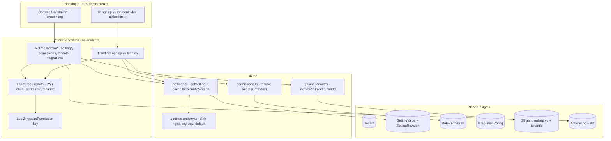
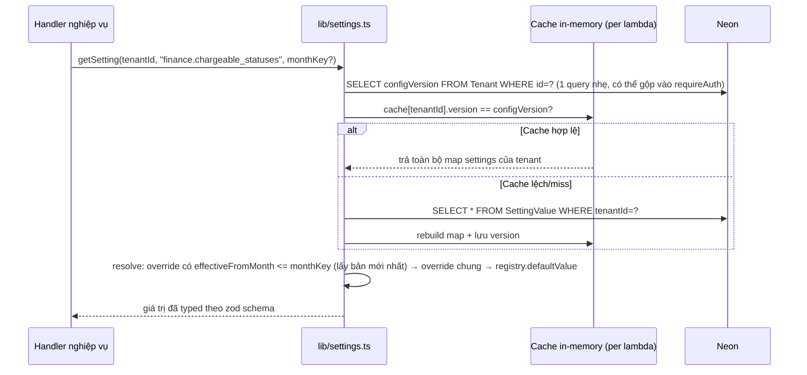
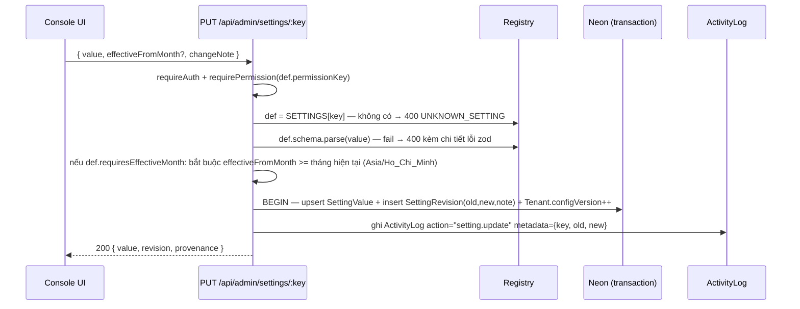

# ADMIN CONSOLE — PRD & KẾ HOẠCH TRIỂN KHAI CHI TIẾT

> **Dự án**: EDU_MANAGER_V2 · **Phiên bản tài liệu**: 2.1 · **Ngày**: 2026-08-12 · **Trạng thái**: THIẾT KẾ ĐÃ CHỐT — SẴN SÀNG THỰC THI
> (Các quyết định kỹ thuật do kiến trúc sư chốt theo ủy quyền của chủ dự án — xem Phần VII.)
>
> **Các quyết định đã chốt với chủ dự án:**
> 1. Multi-tenant ngay từ đầu (nhiều trung tâm dùng chung platform).
> 2. Console chạy tại đường dẫn `/admin` trên app hiện tại; tách subdomain thật khi có custom domain.
> 3. Phạm vi V1 = Tài chính + Học thuật + Phân quyền + Feature flags/Tích hợp. (Vận hành, Branding mở rộng: để V2.)
> 4. Dùng role `admin` hiện có để vào console (không tạo role mới).

---

## MỤC LỤC

- [Phần I — Tổng quan](#phần-i--tổng-quan)
- [Phần II — Kiến trúc & Mô hình dữ liệu](#phần-ii--kiến-trúc--mô-hình-dữ-liệu)
- [Phần III — Kế hoạch theo Phase / Work Package / Task](#phần-iii--kế-hoạch-chi-tiết)
  - [Phase 0 — Tiền đề an toàn dữ liệu](#phase-0)
  - [Phase 1 — Nền tảng Multi-tenant](#phase-1)
  - [Phase 2 — Config Service + Console Shell](#phase-2)
  - [Phase 3 — Module Tài chính + Học thuật](#phase-3)
  - [Phase 4 — Ma trận phân quyền](#phase-4)
  - [Phase 5 — Flags, Tích hợp & Hoàn thiện](#phase-5)
- [Phần IV — Bản đồ phụ thuộc & Milestones](#phần-iv--bản-đồ-phụ-thuộc--milestones)
- [Phần V — Chiến lược Test & Metrics](#phần-v--chiến-lược-test--metrics)
- [Phần VI — Rủi ro & Giảm thiểu](#phần-vi--rủi-ro--giảm-thiểu)
- [Phần VII — Quyết định kỹ thuật đã chốt](#phần-vii--quyết-định-kỹ-thuật-đã-chốt)

---

# PHẦN I — TỔNG QUAN

## I.1. Admin Console là gì trong hệ thống này

Admin Console là **mặt phẳng điều khiển (control plane)** của Edu Manager, tách biệt về mặt khái niệm với **mặt phẳng nghiệp vụ (operational plane)** hiện tại:

| | Mặt phẳng nghiệp vụ (hiện có) | Mặt phẳng điều khiển (xây mới) |
|---|---|---|
| Người dùng | Admin + Lễ tân hằng ngày | Admin cấu hình hệ thống, Platform Owner |
| Câu hỏi trả lời | "Hôm nay thu phí ai, điểm danh lớp nào?" | "Hệ thống *vận hành theo quy tắc nào*?" |
| Ví dụ | Thu phí, điểm danh, nhập điểm progress | Đổi trọng số rubric, đổi chính sách phụ thu, mở/khóa quyền lễ tân, bật/tắt nhắc phí |
| Đường dẫn | `/students`, `/fee-collection`, … | `/admin/*` |
| Tính chất dữ liệu | Bản ghi giao dịch (transaction) | Cấu hình + phiên bản + audit (configuration) |

**3 trụ cột kỹ thuật** của console:

1. **Tenancy** — mọi dữ liệu thuộc về một `Tenant` (trung tâm). Đây là điều kiện tiên quyết vì cấu hình phải gắn theo tenant ("trung tâm A dùng rubric X, trung tâm B dùng rubric Y").
2. **Config Service** — một dịch vụ cấu hình tập trung theo mẫu "registry trong code, giá trị trong DB": mỗi tham số có định nghĩa (kiểu, schema validate, giá trị mặc định = hằng số hiện tại) khai báo trong code; DB chỉ lưu **override**. Mọi thay đổi được version hóa, có audit diff và rollback. Tham số ảnh hưởng tiền/điểm bắt buộc gắn `effectiveFromMonth` — **không bao giờ tính lại quá khứ**.
3. **Permission Service** — ma trận quyền trung tâm thay cho 3 danh sách hardcode song song hiện nay (22 mảng role backend + 13 route guard + 12 cờ sidebar).

## I.2. Hiện trạng (kết quả audit codebase ngày 12/08/2026)

Audit toàn bộ codebase cho kết quả: **thứ duy nhất cấu hình được qua UI là `CenterSettings` — 5 trường branding** (`prisma/schema.prisma:943-953`). Toàn bộ phần còn lại nằm cứng trong code hoặc env:

| Nhóm | Tham số đang hardcode | Vị trí |
|---|---|---|
| Tài chính | Trạng thái điểm danh tính phí (`present`, `absent_with_fee`) | `lib/tuition.ts:44`, `lib/tuition-v3.ts:93-96` |
| Tài chính | Ngày học chuẩn trong tuần (T2–T7) | `lib/tuition.ts:45` |
| Tài chính | Chính sách phụ thu buổi ngoài lịch (chia đều tháng ÷ số buổi, hoặc phí/buổi) | `lib/tuition-v3-service.ts:99-113` |
| Tài chính | Công thức prorate + làm tròn VND | `lib/tuition-v3.ts:156-169,268` |
| Tài chính | Giới hạn bulk-pay 500 dòng, bulk action 100 | `lib/monthly-fee-lines.ts:7`, `lib/validation.ts:328` |
| Học thuật | Catalog track Cambridge (Starters→PET) + keyword tự nhận diện | `lib/student-progress-assessment.ts:132-172, 387-396` |
| Học thuật | Trọng số rubric theo loại lớp + override theo track | `lib/student-progress-assessment.ts:214-295` |
| Học thuật | Blend điểm tổng 0.6 skill / 0.25 attendance / 0.15 consistency | `lib/student-progress-assessment.ts:573` |
| Học thuật | Ngưỡng readiness 85 (on_track) / 70 (watch) / 78 (risk-adjusted) | `lib/student-progress-assessment.ts:469-473` |
| Bảo mật | TTL session: staff 8h, parent 7 ngày | `lib/auth-session.ts:17-20` |
| Bảo mật | Role chỉ có `admin`/`receptionist` (enum Prisma + TS type) | `schema.prisma:59-62`, `lib/auth.ts:18` |
| Bảo mật | Rate limit login 10 lần/15 phút (env-overridable) | `lib/distributed-rate-limit.ts:38-46` |
| Tích hợp | Kill-switch nhắc phí `REMINDER_SEND_ENABLED`, webhook URL/token — env only | `lib/fee-reminders.ts:63-88` |
| Tích hợp | Nội dung tin nhắn nhắc phí — chuỗi tiếng Việt cố định | `lib/fee-reminders.ts:49` |
| RBAC | 22 mảng role hardcode backend + 13 `AdminOnly` route + 12 cờ `adminOnly` sidebar | `server/api/**`, `frontend/src/App.jsx:83-110`, `frontend/src/components/layout/Sidebar.jsx:37-91` |

**Khoảng trống hạ tầng:** không có bảng settings tổng quát, không có feature flags, không có permission matrix, không có tenant, ActivityLog không lưu diff before/after, ~20 env var không có trang nào hiển thị trạng thái.

**Điểm thuận lợi:** auth tập trung qua `requireAuth` (JWT bearer đã mang `role`), có helper `requireAdmin` (`lib/auth.ts:180-188`), pattern snapshot bất biến đã tồn tại (`calculationSnapshot`, `rubricSnapshot`, revision tables + DB trigger) — chính là pattern mà Config Service sẽ noi theo. 8 trang quản trị rời rạc (`/users`, `/settings`, `/audit-logs`, `/backups`, `/recycle-bin`, `/fee-reminders`, `/imports`, `/templates`) là bộ xương console có sẵn.

## I.3. Trạng thái đích sau V1 (Definition of Success)

1. Hệ thống multi-tenant: tạo được trung tâm thứ 2, dữ liệu 2 trung tâm cách ly tuyệt đối; trung tâm hiện tại chạy y nguyên không đổi hành vi.
2. Admin vào `/admin` thấy console 7 nhóm (Trung tâm · Tổ chức · Học thuật · Tài chính · Người dùng & Quyền · Tích hợp · Hệ thống), có ô tìm kiếm setting, mỗi control có nhãn nguồn gốc ("Mặc định hệ thống" / "Đã tùy chỉnh bởi X ngày Y").
3. ~40 tham số trong bảng I.2 chỉnh được qua UI, validate chặt, có lịch sử phiên bản + rollback 1-click, tham số tài chính/học thuật chỉ áp dụng từ tháng chỉ định trở đi.
4. Quyền của lễ tân/admin điều khiển bằng ma trận toggle thay vì sửa code; sidebar và route tự phản ánh theo quyền.
5. Nhắc phí bật/tắt và cấu hình webhook ngay trong console, không cần đổi env + redeploy.
6. Khi chưa có bất kỳ override nào: mọi output (học phí, điểm, PDF, báo cáo) **bằng bit-for-bit** so với trước dự án. Đây là gate số 1.

## I.4. IA (Information Architecture) của Console

Theo mẫu scope-first của Google Workspace Admin / Microsoft 365 Admin Center:

```
/admin
├── (Dashboard)          — tóm tắt: tenant, số setting đã tùy chỉnh, thay đổi gần đây
├── /admin/tenants       — [chỉ Platform Owner] danh sách trung tâm, tạo/đổi tên/tạm ngưng
├── /admin/organization  — thông tin trung tâm (CenterSettings), múi giờ/tháng nghiệp vụ (read-only V1)
├── /admin/academic      — track catalog · rubric editor · ngưỡng readiness · blend điểm · độ khó
├── /admin/finance       — trạng thái tính phí · ngày học chuẩn · phụ thu · nhắc phí · giới hạn bulk
├── /admin/access        — ma trận quyền · chính sách session · rate limit login
├── /admin/integrations  — webhook Zalo/SMS · template tin nhắn · feature flags
├── /admin/system        — trạng thái env/cron · liên kết 8 trang quản trị cũ (audit-logs, backups, …)
└── /admin/settings/:key/history — lịch sử phiên bản + rollback (dùng chung mọi setting)
```

---

# PHẦN II — KIẾN TRÚC & MÔ HÌNH DỮ LIỆU

## II.1. Sơ đồ kiến trúc tổng thể



## II.2. Mô hình dữ liệu mới (Prisma)

```prisma
model Tenant {
  id            String   @id @default(cuid())
  slug          String   @unique          // "gau-center"
  name          String
  status        String   @default("active") // active | suspended
  configVersion Int      @default(0)      // tăng mỗi lần ghi setting/permission → cache invalidation
  createdAt     DateTime @default(now())
  updatedAt     DateTime @updatedAt
  users         User[]
  settingValues SettingValue[]
}

model SettingValue {
  id                 String    @id @default(cuid())
  tenantId           String
  tenant             Tenant    @relation(fields: [tenantId], references: [id], onDelete: Restrict)
  key                String    // phải tồn tại trong registry, vd "finance.chargeable_statuses"
  value              Json      // đã validate bằng zod schema của registry trước khi ghi
  effectiveFromMonth String?   // "YYYY-MM" — bắt buộc nếu registry đánh dấu requiresEffectiveMonth
  updatedById        String
  updatedBy          User      @relation(fields: [updatedById], references: [id], onDelete: Restrict)
  createdAt          DateTime  @default(now())
  updatedAt          DateTime  @updatedAt
  revisions          SettingRevision[]
  @@unique([tenantId, key, effectiveFromMonth])
  @@index([tenantId, key])
}

model SettingRevision {           // append-only, DB trigger chặn UPDATE/DELETE (pattern MonthlyFeeLineRevision có sẵn)
  id             String   @id @default(cuid())
  settingValueId String
  settingValue   SettingValue @relation(fields: [settingValueId], references: [id], onDelete: Restrict)
  revision       Int      // tăng dần theo settingValueId
  oldValue       Json?    // null nếu là lần đặt đầu (trước đó dùng default)
  newValue       Json
  changeNote     String?  @db.VarChar(500)
  changedById    String
  changedBy      User     @relation(fields: [changedById], references: [id], onDelete: Restrict)
  createdAt      DateTime @default(now())
  @@unique([settingValueId, revision])
  @@index([settingValueId])
}

model RolePermission {            // chỉ lưu override so với default trong code
  id            String  @id @default(cuid())
  tenantId      String
  role          Role    // enum hiện có: admin | receptionist
  permissionKey String  // vd "fees.bulk_pay" — phải tồn tại trong PERMISSION_CATALOG
  allowed       Boolean
  updatedById   String
  updatedAt     DateTime @updatedAt
  @@unique([tenantId, role, permissionKey])
  @@index([tenantId, role])
}

model IntegrationConfig {
  id              String   @id @default(cuid())
  tenantId        String
  kind            String   // "fee_reminder_webhook" | "sms_webhook"
  config          Json     // phần không nhạy cảm: url, enabled, template
  secretEncrypted String?  // AES-256-GCM bằng INTEGRATION_ENCRYPTION_KEY (env) — tái dùng pattern lib/backup.ts:75-107
  updatedById     String
  createdAt       DateTime @default(now())
  updatedAt       DateTime @updatedAt
  @@unique([tenantId, kind])
}

// SỬA model hiện có:
// User          : + tenantId String, + isPlatformOwner Boolean @default(false), @@unique([tenantId, username])
// CenterSettings: bỏ singleton id=1 → id cuid + tenantId @unique (1 row/tenant)
// ~35 model nghiệp vụ: + tenantId String (non-null, FK Restrict, @@index), cập nhật unique composite (chi tiết T1.2)
```

## II.3. Setting Registry — hợp đồng trung tâm

Registry là **nguồn sự thật về "hệ thống có những tham số gì"**. DB không bao giờ chứa key lạ; code không bao giờ đọc key chưa khai báo.

```typescript
// lib/settings-registry.ts
import { z } from "zod";

export type SettingImpact = "none" | "financial" | "academic" | "security";

export interface SettingDef<T = unknown> {
  key: string;                 // "group.name", vd "academic.readiness_thresholds"
  group: "finance" | "academic" | "access" | "integrations" | "organization" | "flags";
  labelVi: string;             // nhãn hiển thị console
  descriptionVi: string;       // mô tả + cảnh báo hệ quả
  schema: z.ZodType<T>;        // validate TRƯỚC khi ghi DB
  defaultValue: T;             // = hằng số hardcode hiện tại → 0 override = hành vi cũ
  impact: SettingImpact;
  requiresEffectiveMonth: boolean; // true với mọi setting financial/academic
  permissionKey: string;       // quyền cần có để sửa, vd "console.finance.edit"
}

// Ví dụ 3 entry tiêu biểu (danh sách đầy đủ ~40 entry: xem T2.2):
export const SETTINGS: SettingDef[] = [
  {
    key: "finance.chargeable_statuses",
    group: "finance",
    labelVi: "Trạng thái điểm danh được tính phí",
    descriptionVi: "Các trạng thái điểm danh sẽ bị tính vào học phí. Thay đổi chỉ áp dụng từ tháng hiệu lực.",
    schema: z.array(z.enum(["present", "absent_with_fee", "absent_no_fee", "late"])).min(1),
    defaultValue: ["present", "absent_with_fee"],       // = lib/tuition.ts:44
    impact: "financial", requiresEffectiveMonth: true,
    permissionKey: "console.finance.edit",
  },
  {
    key: "academic.readiness_thresholds",
    group: "academic",
    labelVi: "Ngưỡng sẵn sàng (readiness)",
    descriptionVi: "Điểm tổng >= on_track là 'Đạt chuẩn', >= watch là 'Cần theo dõi', dưới là 'Cần hỗ trợ'.",
    schema: z.object({ onTrack: z.number().min(50).max(100), watch: z.number().min(0).max(99), riskAdjusted: z.number().min(0).max(100) })
      .refine(v => v.onTrack > v.watch, "onTrack phải lớn hơn watch"),
    defaultValue: { onTrack: 85, watch: 70, riskAdjusted: 78 }, // = student-progress-assessment.ts:469-473
    impact: "academic", requiresEffectiveMonth: true,
    permissionKey: "console.academic.edit",
  },
  {
    key: "flags.fee_reminders_enabled",
    group: "flags",
    labelVi: "Bật gửi nhắc phí thật",
    descriptionVi: "Kill-switch. Tắt = mọi lệnh gửi chỉ chạy dry-run. Thay thế env REMINDER_SEND_ENABLED.",
    schema: z.boolean(),
    defaultValue: false,                                 // fail-closed như env hiện tại
    impact: "none", requiresEffectiveMonth: false,
    permissionKey: "console.integrations.edit",
  },
];
```

## II.4. Luồng đọc setting (hot path — mọi request nghiệp vụ)



**Quy tắc resolve theo tháng** (cho setting `requiresEffectiveMonth`): với `monthKey` cho trước, chọn `SettingValue` có `effectiveFromMonth` lớn nhất mà `<= monthKey`; nếu không có → `defaultValue`. Tháng đã có snapshot (`rubricSnapshot`, `calculationSnapshot`) **không gọi lại** getSetting — snapshot thắng tuyệt đối.

## II.5. Luồng ghi setting (console)



Rollback = `POST /api/admin/settings/:key/rollback { revisionId }` → đọc `oldValue` của revision đó, ghi như một lần PUT mới (tạo revision mới, không xóa gì — append-only).

---

# PHẦN III — KẾ HOẠCH CHI TIẾT

Quy ước: mỗi task có **ID · Mô tả · Files · Logic/Data · Test · DoD · Phụ thuộc**. Effort: S (≤0.5 ngày), M (~1 ngày), L (2–3 ngày).

<a id="phase-0"></a>
## PHASE 0 — TIỀN ĐỀ AN TOÀN DỮ LIỆU (bắt buộc trước mọi thứ)

> **Mục tiêu**: bảo đảm có đường lùi (backup khôi phục được thật) trước khi chạy migration lớn nhất lịch sử dự án ở Phase 1.
> **Milestone M0**: "Backup đáng tin" — backup production tạo mới, verify được, và đã diễn tập restore thành công trên môi trường copy.
> Lý do tồn tại của phase này: audit `Audit_V2.md` phát hiện `BACKUP_MANIFEST` trong `lib/backup.ts` **thiếu 4 model Tuition V3** (`ClassMonthPlan`, `ClassMonthPlanRevision`, `ClassSession`, `MonthlyFeeLineRevision`) — nghĩa là backup hiện tại restore ra sẽ mất dữ liệu học phí. Migration Phase 1 mà không có backup đúng là rủi ro không thể chấp nhận.

**T0.1 — Sửa BACKUP_MANIFEST + restore/reset ordering (= AUDV2-P1 của Audit_V2)** (M)
- **Mô tả**: Thực thi đúng todo AUDV2-P1-01/02 trong `Audit_V2.md`: bổ sung 4 model Tuition V3 (và các model Progress nếu thiếu) vào `BACKUP_MANIFEST`, cập nhật thứ tự restore/reset theo FK dependency, test round-trip backup→restore trên DB copy.
- **Files**: `lib/backup.ts` (theo chi tiết trong Audit_V2).
- **Test**: round-trip trên copy production — count từng bảng trước/sau restore khớp 100%.
- **DoD**: backup mới chứa đủ 100% bảng có dữ liệu; evidence bảng đối chiếu.
- **Phụ thuộc**: không. **Mọi task Phase 1 phụ thuộc task này.**

**T0.2 — Diễn tập migration trên bản sao production** (M)
- **Mô tả**: Tạo Neon branch (tính năng branch database của Neon) từ production; chạy **toàn bộ chuỗi migration Phase 1** (T1.1→T1.4) trên branch; đo thời gian từng migration; ghi playbook rollback (khôi phục từ backup + point-in-time restore của Neon).
- **Test**: verify script T1.3 pass trên branch; app trỏ vào branch chạy smoke 10 flow.
- **DoD**: playbook `docs/artifacts/tenancy-migration-playbook.md` gồm: thứ tự lệnh, thời gian đo được, tiêu chí go/no-go, cách rollback.
- **Phụ thuộc**: T0.1.

<a id="phase-1"></a>
## PHASE 1 — NỀN TẢNG MULTI-TENANT

> **Mục tiêu**: mọi dữ liệu thuộc về một Tenant; hệ thống chạy y nguyên với tenant mặc định; cách ly dữ liệu tuyệt đối giữa các tenant.
> **Milestone M1**: "Tenancy live" — deploy production, người dùng không nhận thấy khác biệt, test isolation pass.
> **Đây là phase rủi ro cao nhất** (migration dữ liệu production ~35 bảng). Không phase nào sau chạy được nếu M1 chưa đạt.
> **Điều kiện vào phase**: M0 đạt (backup đúng + đã diễn tập migration trên Neon branch).

### WP1.1 — Schema & Migration dữ liệu

**T1.1 — Model `Tenant` + seed tenant mặc định** (M)
- **Mô tả**: Tạo bảng Tenant; migration seed 1 row từ dữ liệu `CenterSettings` hiện tại (name = `centerName`, slug = "default").
- **Files**: `prisma/schema.prisma`, migration mới `add_tenant`.
- **Logic/Data**: như II.2. Seed bằng SQL trong migration (không seed script riêng) để đảm bảo chạy đúng 1 lần theo thứ tự.
- **Test**: migrate trên DB copy → tồn tại đúng 1 tenant, slug "default".
- **DoD**: `npx prisma migrate deploy` sạch trên copy production; schema validate pass.
- **Phụ thuộc**: M0 (T0.1, T0.2).

**T1.2 — Thêm `tenantId` vào toàn bộ model nghiệp vụ — bước 1: nullable** (L)
- **Mô tả**: Quét `prisma/schema.prisma`, liệt kê chốt danh sách model cần tenant hóa (dự kiến ~35: User, CenterSettings, Student, Parent, Teacher, Class, enrollment/ClassStudent, Attendance, MonthlyFee, MonthlyFeeLine, MonthlyFeeLineRevision, ClassMonthPlan, ClassMonthPlanRevision, ClassSession, Receipt, Payment, Template, ActivityLog, StudentProgressMonth, StudentProgressSkill, StudentProgressDailyEntry, StudentProgressRevision, các bảng import/reminder nếu có…). **Loại trừ**: AuthSession (gắn theo User), bảng rate-limit kỹ thuật. Thêm `tenantId String?` (nullable) + index — chưa có FK để backfill nhanh.
- **Files**: `prisma/schema.prisma`, migration `add_tenant_id_nullable`.
- **Logic**: bước 1 của chiến lược 3 bước (nullable → backfill → non-null). Lý do: thêm cột non-null có default sẽ khóa bảng lâu; tách bước an toàn hơn và cho phép verify giữa chừng.
- **Test**: migrate sạch; app hiện tại vẫn chạy (cột nullable chưa ai đọc).
- **DoD**: danh sách model chốt được ghi thành bảng trong migration note; CI test suite hiện có pass nguyên vẹn.
- **Phụ thuộc**: T1.1.

**T1.3 — Backfill + verify** (M)
- **Mô tả**: Migration SQL `UPDATE <bảng> SET "tenantId" = (SELECT id FROM "Tenant" WHERE slug='default') WHERE "tenantId" IS NULL` cho từng bảng, kèm script verify đếm.
- **Files**: migration `backfill_tenant_id`, `scripts/verify-tenant-backfill.ts`.
- **Logic verify**: với từng bảng: `count(*) == count(tenantId IS NOT NULL)` và `count(*)` trước == sau. Ghi kết quả ra bảng đối chiếu trong receipt.
- **Test**: chạy trên copy production; verify script exit 0.
- **DoD**: bảng đối chiếu count 100% khớp, đính kèm làm evidence.
- **Phụ thuộc**: T1.2.

**T1.4 — Siết non-null + FK + unique constraint composite** (L)
- **Mô tả**: Migration đổi `tenantId` thành non-null + FK `onDelete: Restrict`; cập nhật unique constraint bị ảnh hưởng.
- **Data — các constraint phải đổi (rà đủ khi thực thi)**:
  - `User.username @unique` → `@@unique([tenantId, username])`
  - `MonthlyFee @@unique([studentId, classId, month])` → thêm `tenantId` (an toàn dù studentId đã hàm chứa tenant — nhất quán và hỗ trợ index)
  - `CenterSettings` singleton `id=1` → `tenantId @unique`
  - `Template` default-per-type resolve (`lib/api-utils.ts:191-205`) → unique/lookup theo tenant
  - Slug/mã tự sinh khác nếu có unique toàn cục.
- **Files**: `prisma/schema.prisma`, migration `enforce_tenant_id`.
- **Test**: migrate sạch trên copy; insert 2 user cùng username khác tenant → OK; cùng tenant → fail đúng.
- **DoD**: schema cuối cùng không còn `tenantId String?` nào ở model nghiệp vụ.
- **Phụ thuộc**: T1.3.

### WP1.2 — Tenant scoping ở runtime

**T1.5 — Prisma tenant extension** (L) — **task quan trọng nhất Phase 1**
- **Mô tả**: Tạo `lib/prisma-tenant.ts` export `getTenantClient(tenantId)` — Prisma `$extends` với query middleware tự inject `tenantId` vào `where`/`data` cho mọi model trong danh sách scoped. Handler **không bao giờ** tự viết `where: { tenantId }`.
- **Logic (pseudocode)**:

```typescript
const TENANT_SCOPED_MODELS = new Set(["Student", "Class", /* …35 model từ T1.2 */]);

export function getTenantClient(tenantId: string) {
  return prisma.$extends({
    query: {
      $allModels: {
        async $allOperations({ model, operation, args, query }) {
          if (!TENANT_SCOPED_MODELS.has(model)) return query(args);
          if (READ_OPS.has(operation))  args.where = { AND: [{ tenantId }, args.where ?? {}] };
          if (CREATE_OPS.has(operation)) args.data  = injectTenantIntoData(args.data, tenantId);
          if (operation === "upsert")   { /* inject cả where, create, update */ }
          return query(args);
        },
      },
    },
  });
}
```

- **Điểm gài**: `requireAuth` (lib/auth.ts) sau khi verify JWT sẽ gắn `req.db = getTenantClient(payload.tenantId)`; handler đổi `prisma.` → `req.db.` (sweep cơ học, có codemod/grep hỗ trợ).
- **Cache client**: giữ map `tenantId → extendedClient` (extension nhẹ, nhưng tránh tạo mới mỗi request).
- **Test**: unit test extension với 2 tenant: findMany/create/update/delete/upsert/aggregate/groupBy/count đều bị scope; cố tình truyền `where: { tenantId: "khac" }` → bị AND đè, không rò.
- **DoD**: 100% handler nghiệp vụ dùng `req.db`; grep `prisma.` trực tiếp trong `server/api/**` chỉ còn các chỗ được whitelist (auth, cron, backup — xử lý ở T1.6).
- **Phụ thuộc**: T1.4.

**T1.6 — Audit raw query & luồng đặc biệt** (M)
- **Mô tả**: Rà mọi `$queryRaw`/`$executeRaw`/`$transaction` không đi qua extension và các luồng không có user context.
- **Điểm đã biết phải sửa**: `lib/backup.ts` (đọc `BACKUP_MANIFEST`, snapshot tx 60s — backup theo **toàn DB** hay theo tenant? → V1: backup toàn DB như cũ, ghi rõ trong manifest là multi-tenant); `server/api/cron/monthly-fees.ts` (cron chạy **cho từng tenant active** — vòng lặp tenants); trigger SQL immutability (không đổi); `lib/monthly-fee-generator.ts` transaction.
- **Test**: cron trên DB 2 tenant → sinh phí đúng cho cả 2, không lẫn.
- **DoD**: bảng kiểm kê raw-query kèm quyết định từng dòng (giữ nguyên/sửa) trong receipt.
- **Phụ thuộc**: T1.5.

### WP1.3 — Auth mang tenant

**T1.7 — JWT + AuthSession + parent token mang `tenantId`** (M)
- **Mô tả**: `lib/auth.ts` thêm claim `tenantId` khi sign; verify đọc claim; `lib/auth-session.ts` lưu tenant theo session; parent-portal token (`server/api/parent-portal/login.ts`) tương tự. Token cũ (không có claim) → fallback tenant default trong 30 ngày chuyển tiếp, sau đó reject.
- **Files**: `lib/auth.ts`, `lib/auth-session.ts`, `server/api/auth/login.ts`, `server/api/parent-portal/login.ts`.
- **Logic login**: username giờ unique theo `[tenantId, username]` → màn login V1 vẫn 1 tenant hiển thị như cũ; resolve tenant qua user record (username toàn cục vẫn unique thực tế vì mới có 1 tenant; khi có tenant 2, login form thêm trường "mã trung tâm" — để V2, ghi nhận hạn chế).
- **Test**: login → token decode có tenantId; token cũ vẫn dùng được (fallback); sau khi bật cứng → 401.
- **DoD**: `/auth/me` trả `{ tenant: { id, slug, name } }`.
- **Phụ thuộc**: T1.1 (cần tenant id), song song được với WP1.1 còn lại.

**T1.8 — Cờ `isPlatformOwner` + guard platform** (S)
- **Mô tả**: Thêm cột trên User; migration set `true` cho tài khoản admin đầu tiên (id nhỏ nhất); helper `requirePlatformOwner` trong `lib/auth.ts`.
- **Test**: user thường gọi API tenant-management → 403.
- **DoD**: đúng 1 user là owner sau migration.
- **Phụ thuộc**: T1.1.

**T1.9 — CenterSettings per-tenant** (S)
- **Mô tả**: Bỏ `ensureSettings()` upsert id=1 (`server/api/center-settings/index.ts:25-31`) → upsert theo `tenantId`; trang `/settings` không đổi UI.
- **Test**: 2 tenant có 2 bộ branding độc lập.
- **Phụ thuộc**: T1.4, T1.7.

### WP1.4 — Kiểm chứng Phase 1

**T1.10 — Bộ test cách ly cross-tenant** (L)
- **Mô tả**: Harness tạo tenant "test-b" + seed tối thiểu (1 student, 1 class, 1 fee); với **từng nhóm endpoint** (students, classes, attendance, monthly-fees, receipts, payments, progress, templates, reports): đăng nhập tenant A, gọi list/get/update/delete nhắm vào id của tenant B → kỳ vọng 404/403, **không bao giờ 200**.
- **Files**: `tests/tenant-isolation.test.ts` (hoặc theo cấu trúc test hiện có).
- **DoD**: 0 endpoint rò; chạy trong CI mọi PR về sau.
- **Phụ thuộc**: T1.5, T1.6, T1.7.

**T1.11 — Regression + backup round-trip + deploy M1** (M)
- **Mô tả**: Chạy toàn bộ test suite hiện có + backup/restore round-trip trên schema mới (phối hợp với todo `AUDV2-P1` của Audit_V2 về BACKUP_MANIFEST) + smoke test production sau deploy.
- **DoD — Gate M1**: (1) suite pass 100%; (2) count đối chiếu migration khớp 100%; (3) isolation test 0 rò; (4) app production hoạt động y nguyên (checklist smoke 10 flow chính).
- **Phụ thuộc**: tất cả task Phase 1.

<a id="phase-2"></a>
## PHASE 2 — CONFIG SERVICE + CONSOLE SHELL

> **Mục tiêu**: hạ tầng setting versioned + rollback + audit hoạt động end-to-end; console `/admin` có shell, search, form tự sinh từ registry.
> **Milestone M2**: "Console live, 0 override = hành vi cũ" — admin mở được `/admin`, sửa được 1 setting vô hại (vd nội dung tin nhắn), thấy lịch sử, rollback được.

### WP2.1 — Nền dữ liệu

**T2.1 — Bảng `SettingValue` + `SettingRevision` + trigger bất biến** (M)
- **Mô tả**: Migration 2 bảng như II.2 + DB trigger chặn UPDATE/DELETE trên `SettingRevision` (copy pattern trigger của `MonthlyFeeLineRevision` đã có trong repo).
- **Test**: UPDATE revision trực tiếp bằng SQL → bị trigger chặn.
- **Phụ thuộc**: M1 (cần tenantId).

**T2.2 — Registry đầy đủ ~40 key** (L)
- **Mô tả**: Viết `lib/settings-registry.ts` với **toàn bộ** key V1. Mỗi entry phải có `defaultValue` sao chép **đúng nguyên trạng** hằng số hiện tại (kể cả giá trị "xấu"), vì mục tiêu là 0-override = 0 thay đổi. Danh mục key:

| Key | Default lấy từ | Impact / EffMonth |
|---|---|---|
| `finance.chargeable_statuses` | `lib/tuition.ts:44` | financial / có |
| `finance.default_session_days` | `lib/tuition.ts:45` | financial / có |
| `finance.extra_session_policy` | `lib/tuition-v3-service.ts:99-113` (enum: `derive_monthly` \| `per_session_fee`) | financial / có |
| `finance.makeup_default_reason` | `lib/tuition.ts:46` | none |
| `finance.bulk_pay_max_lines` | `lib/monthly-fee-lines.ts:7` (500) | none |
| `finance.bulk_actions_max` | `lib/validation.ts:328` (100) | none |
| `finance.class_default_max_students` | `schema.prisma:217` (50) | none |
| `finance.reminder_message_template` | `lib/fee-reminders.ts:49` (biến `{{ten}} {{lop}} {{thang}} {{sotien}}`) | none |
| `finance.reminder_due_day` | hiện ngầm định — chốt giá trị khi thực thi | none |
| `academic.track_catalog` | `student-progress-assessment.ts:132-172` (array object: key, label, cefr, keywords, canDo) | academic / có |
| `academic.rubric_base_weights` | `:214-245` (map classType → weights, tổng=100) | academic / có |
| `academic.rubric_track_overrides` | `:247-295` | academic / có |
| `academic.score_blend` | `:573` ({skill:0.6, attendance:0.25, consistency:0.15}, tổng=1) | academic / có |
| `academic.readiness_thresholds` | `:469-473` (85/70/78) | academic / có |
| `academic.fallback_score_weights` | `:444` (0.72/0.28) | academic / có |
| `academic.consistency_penalties` | `:449-451` (4/10/5) | academic / có |
| `academic.difficulty_weights` | `lib/progress-difficulty.ts:11-13` (0.15, 0.7–1.3) | academic / có |
| `access.staff_session_hours` | `lib/auth-session.ts:17` (8) | security |
| `access.parent_session_days` | `lib/auth-session.ts:20` (7) | security |
| `access.login_rate_limit` | `lib/distributed-rate-limit.ts:43-44` ({windowMs, max}) | security |
| `flags.fee_reminders_enabled` | env `REMINDER_SEND_ENABLED` (default false — fail-closed) | none |
| `flags.parent_portal_enabled` | true | none |
| `organization.business_timezone` | `lib/api-utils.ts:113` — **V1 read-only** hiển thị, chưa cho sửa | — |
| … (bổ sung khi sweep, mục tiêu ≤ 45 key V1) | | |

- **Test**: unit test registry: key unique, schema parse(defaultValue) pass 100%, mọi entry financial/academic có `requiresEffectiveMonth=true`.
- **DoD**: bảng key hoàn chỉnh được in vào docs.
- **Phụ thuộc**: không (viết song song Phase 1 được — chỉ phụ thuộc khi wire).

**T2.3 — `lib/settings.ts` (service đọc)** (M)
- **Mô tả**: Cài `getSetting`/`getSettings` theo luồng II.4; cache module-level per lambda `Map<tenantId, {version, values}>`; check version qua 1 query `SELECT configVersion` (gộp được vào query auth-session sẵn có để không thêm round-trip).
- **Logic resolve**: xem II.4. Trả về đã `schema.parse` (nếu DB chứa dữ liệu hỏng do downgrade code → log lỗi + **fallback default**, không crash nghiệp vụ).
- **Test**: unit — default khi chưa override; override chung; override theo effectiveFromMonth (3 mốc tháng); cache hit không query SettingValue; version tăng → reload.
- **Phụ thuộc**: T2.1, T2.2.

### WP2.2 — API console

**T2.4 — API `/api/admin/settings/*`** (L)
- **Mô tả**: 4 endpoint mới đăng ký vào `api/router.ts`:
  - `GET /api/admin/settings?group=` → toàn bộ entry (định nghĩa + giá trị hiện hành + provenance `{isDefault, updatedBy, updatedAt, effectiveFromMonth}`)
  - `PUT /api/admin/settings/:key` → luồng II.5 (validate zod → guard effectiveFromMonth ≥ tháng hiện tại VN → tx: upsert + revision + configVersion++ → ActivityLog diff)
  - `GET /api/admin/settings/:key/revisions` → lịch sử phân trang
  - `POST /api/admin/settings/:key/rollback` → promote oldValue thành revision mới
- **Bảo vệ**: tất cả qua `requireAuth(["admin"])` (Phase 4 sẽ nâng cấp thành `requirePermission`); rate limit ghi 30 lần/phút/user.
- **Test**: integration — PUT giá trị sai schema → 400 kèm path lỗi; PUT key lạ → 400; PUT setting financial thiếu effectiveFromMonth → 400; rollback → giá trị cũ hiệu lực + có revision mới; ActivityLog có old/new.
- **Phụ thuộc**: T2.3.

### WP2.3 — Console UI

**T2.5 — Shell `/admin` + navigation + search** (L)
- **Mô tả**: Route group mới trong `frontend/src/App.jsx` với layout riêng `ConsoleLayout` (sidebar console theo IA I.4, header có nút "← Về ứng dụng"); guard `role==='admin'`; ô search lọc trên metadata registry (labelVi/descriptionVi/key) trả kết quả nhảy thẳng tới control.
- **Files**: `frontend/src/console/ConsoleLayout.jsx`, `ConsoleSidebar.jsx`, `ConsoleSearch.jsx`, `App.jsx`.
- **Tái dùng**: DataTable, Modal, ConfirmModal, design tokens hiện có (copy-import trực tiếp, không cần package hóa vì cùng SPA).
- **Test**: Playwright — receptionist vào `/admin` → redirect; admin thấy đủ 7 mục nav.
- **Phụ thuộc**: M1 (auth), song song với WP2.1–2.2.

**T2.6 — Khung SettingsForm tự sinh từ registry** (L)
- **Mô tả**: Component `SettingField` render control theo `schema` (boolean→toggle, number→input+min/max, enum→select, array/object→editor chuyên dụng hoặc JSON editor có validate); kèm nhãn provenance, nút "Đặt lại về mặc định", nút "Lịch sử"; setting financial/academic hiện modal xác nhận + chọn tháng hiệu lực + cảnh báo đỏ.
- **Files**: `frontend/src/console/SettingsForm.jsx`, `SettingField.jsx`, `SettingHistoryModal.jsx`.
- **Test**: unit render từng loại schema; e2e sửa 1 boolean → provenance đổi thành "Đã tùy chỉnh".
- **Phụ thuộc**: T2.4, T2.5.

**T2.7 — Trang quản lý Tenant (Platform Owner)** (M)
- **Mô tả**: `/admin/tenants` — bảng danh sách + tạo (slug, name) + đổi tên + suspend/activate; API `GET/POST/PATCH /api/admin/tenants` guard `requirePlatformOwner`; suspend → mọi login của tenant đó bị 403 `TENANT_SUSPENDED` (check trong requireAuth).
- **Test**: owner tạo tenant 2 → login tenant 2 độc lập; suspend → 403.
- **Phụ thuộc**: T1.8, T2.5.

**T2.8 — Gate M2: regression 0-override** (M)
- **Mô tả**: Chưa wire consumer nào (Phase 3 mới wire) nhưng chạy trước bộ so sánh chuẩn bị cho Phase 3: script `scripts/capture-baseline.ts` chụp baseline — tổng học phí từng tháng 12 tháng gần nhất, điểm progress từng học sinh tháng hiện tại, checksum PDF mẫu — lưu làm mốc so sánh cho T3.6.
- **DoD — Gate M2**: console dùng được end-to-end trên 1 setting thật; baseline đã chụp và lưu.
- **Phụ thuộc**: T2.4, T2.6.

<a id="phase-3"></a>
## PHASE 3 — MODULE TÀI CHÍNH + HỌC THUẬT

> **Mục tiêu**: các tham số tài chính/học thuật đọc từ Config Service theo tháng; UI chỉnh sửa + mô phỏng trước khi áp dụng.
> **Milestone M3**: "Tham số tiền & điểm điều khiển được từ console, quá khứ bất biến."

### WP3.1 — Wire backend

**T3.1 — Wire nhóm tài chính vào `lib/tuition*`** (L)
- **Mô tả**: Thay từng hằng số bằng `getSetting`:
  - `CHARGEABLE_STATUSES` (`lib/tuition.ts:44`, `lib/tuition-v3.ts:93-96`) → `finance.chargeable_statuses` với `monthKey` của tháng đang tính. **Chữ ký hàm đổi**: các hàm tính phí nhận thêm `settings` context (truyền từ handler, tránh gọi async sâu trong vòng lặp).
  - Ngày học chuẩn, extra_session_policy, makeup reason, bulk caps tương tự.
  - **Không đụng**: công thức prorate/làm tròn (`tuition-v3.ts:156-169`) — giữ code, đã có `calculationVersion`.
- **Quy tắc vàng**: hàm nào tính cho tháng có `calculationSnapshot` → dùng snapshot, không gọi getSetting.
- **Test**: unit per key — đổi setting với effectiveFromMonth = tháng sau → tháng này tính như cũ, tháng sau tính theo mới; tháng đã locked không đổi số.
- **Phụ thuộc**: M2.

**T3.2 — Wire nhóm học thuật vào `student-progress-assessment.ts`** (L)
- **Mô tả**: Track catalog, rubric weights (base + track override), score blend, readiness thresholds, fallback weights, consistency penalties, difficulty weights → đọc qua settings context theo `monthKey` của `StudentProgressMonth`. Tháng có `rubricSnapshot` → snapshot thắng. Khi admin đổi rubric: tháng đang mở (chưa chốt) hiển thị banner "Rubric đã đổi, điểm sẽ tính theo bản mới từ tháng {effectiveFromMonth}".
- **Test**: unit — 1 học sinh 3 tháng (chốt/mở/tương lai) × đổi rubric → chỉ tháng từ effectiveFromMonth đổi điểm.
- **Phụ thuộc**: M2; phối hợp với plan Student_Progress_Dashboard (difficulty weights dùng chung key `academic.difficulty_weights` — cập nhật plan đó khi thực thi).

### WP3.2 — UI console

**T3.3 — Trang `/admin/finance`** (M)
- **Mô tả**: Nhóm form từ SettingsForm (T2.6) theo section: Tính phí (chargeable statuses — checkbox group; ngày học chuẩn — weekday picker; phụ thu — radio), Nhắc phí (template editor có preview biến + due day), Giới hạn (bulk caps — number). Mỗi thay đổi financial mở modal chọn tháng hiệu lực.
- **Phụ thuộc**: T2.6, T3.1.

**T3.4 — Trang `/admin/academic`: rubric editor + track catalog** (L)
- **Mô tả**:
  - **Rubric editor**: bảng ma trận (hàng = kỹ năng, cột = loại lớp/track), ô nhập số, footer tổng từng cột realtime, tổng ≠ 100 → viền đỏ + disable Lưu; kèm cột "Giá trị mặc định" mờ để so sánh.
  - **Track catalog editor**: danh sách track (thêm/sửa/ẩn — không xóa track đã có dữ liệu), mỗi track: key, label, CEFR, keywords (tags input), can-do text.
  - **Ngưỡng readiness + blend**: slider/number với preview dải màu band.
- **Test**: e2e — nhập rubric tổng 99 → không lưu được; thêm track "FCE" → xuất hiện trong dropdown gán track của trang progress.
- **Phụ thuộc**: T2.6, T3.2.

**T3.5 — Mô phỏng (dry-run) trước khi áp dụng** (L)
- **Mô tả**: `POST /api/admin/settings/simulate` body `{ keys: {key: draftValue}, classId, month }` → chạy engine tính điểm/phí **trong bộ nhớ** với draft settings (không ghi DB), trả về bảng so sánh per-student: `{ old, new, delta }`. UI: nút "Mô phỏng" trong trang academic/finance mở modal chọn lớp+tháng → bảng kết quả + tô màu delta.
- **Logic**: tái dùng hàm tính đã refactor nhận `settings` context (T3.1/T3.2) — truyền context draft thay vì context DB. Đây là lý do kiến trúc "truyền settings context" thay vì gọi getSetting sâu bên trong.
- **Test**: simulate không tạo bất kỳ bản ghi nào (assert count trước/sau); kết quả simulate = kết quả thật nếu áp dụng cùng giá trị.
- **Phụ thuộc**: T3.1, T3.2.

**T3.6 — Gate M3: regression tài chính & học thuật lịch sử** (M)
- **Mô tả**: Chạy lại script baseline (T2.8) sau khi wire xong, chưa tạo override nào → so sánh với baseline đã chụp: **0 sai lệch tuyệt đối**. Sau đó tạo 1 override với effectiveFromMonth tháng sau → baseline vẫn khớp.
- **DoD — Gate M3**: 2 lần so sánh đều 0 lệch; evidence lưu receipts/.
- **Phụ thuộc**: T3.1–T3.5.

<a id="phase-4"></a>
## PHASE 4 — MA TRẬN PHÂN QUYỀN

> **Mục tiêu**: một nguồn sự thật cho quyền; admin toggle quyền lễ tân không cần dev.
> **Milestone M4**: "RBAC data-driven" — 22 mảng role hardcode biến mất, sidebar/route tự theo quyền.

**T4.1 — Catalog permission + defaults** (M)
- **Mô tả**: `lib/permissions.ts` khai báo ~25 key nhóm theo domain, **default map đúng 100% hành vi hiện tại** (từ audit 22 mảng role):
  - Admin-only hiện tại → default `admin: true, receptionist: false`: `users.manage`, `backups.manage`, `recycle_bin.manage`, `audit_logs.view`, `fee_reminders.send`, `imports.run`, `bulk_actions.run`, `monthly_fees.generate`, `reports.view` (6 endpoint), `templates.manage`, `users.reset_password`, `console.access`, `console.finance.edit`, `console.academic.edit`, `console.access.edit`, `console.integrations.edit`
  - Admin+receptionist hiện tại → cả hai `true`: `students.manage`, `classes.manage`, `attendance.manage`, `fees.collect`, `receipts.manage`, `progress.view`, `progress.grade` (5 endpoint progress từ audit)
- **DoD**: bảng mapping permission ↔ endpoint hiện tại in vào docs; unit test "default matrix = hành vi cũ".
- **Phụ thuộc**: không (song song Phase 3 được).

**T4.2 — Bảng `RolePermission` + resolve service** (M)
- **Mô tả**: Migration bảng (II.2); `resolvePermissions(tenantId, role)` = defaults ⊕ overrides, cache chung cơ chế configVersion với settings (ghi override cũng `configVersion++`).
- **Test**: unit — không override = default; override lật đúng 1 key không ảnh hưởng key khác.
- **Phụ thuộc**: M1.

**T4.3 — `requirePermission` + sweep 22 handler** (L)
- **Mô tả**: Helper `requirePermission(key)` bọc ngoài `requireAuth`; sweep thay `requireAuth(["admin"])`/mảng role trong 22 handler + inline check `center-settings/index.ts:46` bằng key tương ứng theo bảng T4.1. `requireAuth` giữ nguyên làm lớp xác thực.
- **Test**: integration per handler — role bị tắt quyền → 403 `PERMISSION_DENIED` kèm key; bật lại → 200.
- **Phụ thuộc**: T4.1, T4.2.

**T4.4 — `/auth/me` permissions + frontend gating** (L)
- **Mô tả**: `/auth/me` trả `permissions: string[]` đã resolve. Frontend: context `usePermissions()`; thay 13 `AdminOnly` route wrapper bằng `RequirePermission perm="..."`; sidebar items khai báo `requiredPermission` thay cờ `adminOnly` (12 chỗ, `Sidebar.jsx:37-91`); nút hành động nhạy cảm (xóa, bulk-pay, reset password) ẩn theo permission.
- **Test**: e2e — tắt `reports.view` của receptionist → mục Báo cáo biến mất khỏi sidebar + vào URL trực tiếp bị chặn + API 403 (3 lớp khớp nhau).
- **Phụ thuộc**: T4.3.

**T4.5 — UI ma trận + Security settings + chống lock-out** (M)
- **Mô tả**: `/admin/access` — bảng role × permission toggle (group theo domain, tooltip mô tả); section Security: `access.staff_session_hours`, `access.parent_session_days`, `access.login_rate_limit` (SettingsForm). **Guard chống lock-out**: API từ chối tắt `console.access`/`console.access.edit` của role `admin` (400 `LOCKOUT_PREVENTED`).
- **Test**: e2e toggle + thử tự khóa → bị chặn; đổi TTL → token mới có exp mới, token cũ giữ nguyên.
- **Phụ thuộc**: T4.2, T2.6.

**T4.6 — Gate M4** (S)
- **DoD**: grep không còn mảng role hardcode trong `server/api/**`; matrix default test pass; e2e 3-lớp-khớp pass; toàn suite regression pass.

<a id="phase-5"></a>
## PHASE 5 — FLAGS, TÍCH HỢP & HOÀN THIỆN

> **Milestone M5 (GA)**: console đầy đủ phạm vi V1, E2E xanh, docs + memory cập nhật.

**T5.1 — Feature flags** (M)
- **Mô tả**: Nhóm key `flags.*` (đã khai báo T2.2) + UI toggle riêng trong `/admin/integrations` (hoặc tab Flags); wire `lib/fee-reminders.ts:63` đọc `flags.fee_reminders_enabled` **AND** env cũ trong giai đoạn chuyển tiếp (env=false vẫn chặn — an toàn kép), sau 1 release bỏ env; `flags.parent_portal_enabled=false` → API parent-portal trả 503 + trang parent hiển thị thông báo bảo trì.
- **Test**: flag off → gửi nhắc phí chỉ dry-run; on + webhook cấu hình → gửi thật (staging).
- **Phụ thuộc**: M2.

**T5.2 — `IntegrationConfig` + mã hóa secret + gửi thử** (L)
- **Mô tả**: Migration bảng (II.2); `lib/integration-config.ts` encrypt/decrypt AES-256-GCM (env `INTEGRATION_ENCRYPTION_KEY`, tái dùng đúng pattern `lib/backup.ts:75-107`); chuyển đọc webhook trong `lib/fee-reminders.ts:72-88` từ env → DB (env làm fallback chuyển tiếp); UI form webhook (URL, token — hiển thị dạng `••••` sau lưu, enabled) + nút **"Gửi thử"** gọi `POST /api/admin/integrations/:kind/test` bắn payload mẫu, hiện response.
- **Test**: secret trong DB không đọc được dạng plaintext (assert ciphertext); GET config không bao giờ trả secret; gửi thử với URL sai → báo lỗi rõ.
- **Phụ thuộc**: M2.

**T5.3 — Template tin nhắn nhắc phí** (S)
- **Mô tả**: Wire `finance.reminder_message_template` vào `lib/fee-reminders.ts:49`; render biến `{{ten}} {{lop}} {{thang}} {{sotien}}` (sotien format vi-VN); UI editor có preview với dữ liệu mẫu + validate biến lạ.
- **Phụ thuộc**: T3.3, T5.2.

**T5.4 — Trang `/admin/system` — trạng thái hệ thống** (M)
- **Mô tả**: Read-only: bảng env var quan trọng (CRON_SECRET, BLOB_READ_WRITE_TOKEN, BACKUP_ENCRYPTION_KEY, DATABASE_URL, JWT_SECRET, INTEGRATION_ENCRYPTION_KEY) — **chỉ hiện Đã đặt/Thiếu, không hiện giá trị**; lịch cron khai báo trong `vercel.json:27-36` + lần chạy gần nhất (đọc ActivityLog của cron); version app; liên kết 8 trang quản trị cũ.
- **API**: `GET /api/admin/system-status` (permission `console.access`).
- **Phụ thuộc**: T2.5.

**T5.5 — E2E suite + hardening** (L)
- **Mô tả**: Playwright kịch bản xuyên suốt: (1) đổi setting học thuật với effectiveFromMonth → mô phỏng → áp dụng → điểm tháng mới đổi, tháng cũ giữ; (2) rollback → hành vi cũ; (3) toggle permission → 3 lớp khớp; (4) cross-tenant: tenant B không thấy config/dữ liệu tenant A; (5) suspend tenant → login chặn. Hardening: rate limit API admin, security headers cho `/admin`, kiểm tra không log secret.
- **Phụ thuộc**: mọi task trước.

**T5.6 — Docs + memory write-back + bàn giao** (M)
- **Mô tả**: Cập nhật `PROJECT_CONTEXT.md`, `KANBAN.md`, `memory/memory-bank/{activeContext,progress,decisionLog}.md` (quyết định: shared-schema tenancy, registry pattern, effectiveFromMonth); hướng dẫn sử dụng console cho admin (docs/); receipt tổng.
- **DoD — Gate M5**: E2E xanh trong CI; docs xong; demo checklist cho chủ dự án.

---

# PHẦN IV — BẢN ĐỒ PHỤ THUỘC & MILESTONES

```mermaid
flowchart LR
    subgraph p0 [Phase 0 - Tien de]
        T01[T0.1 Fix BACKUP_MANIFEST] --> T02[T0.2 Dien tap tren Neon branch] --> M0{{M0 Backup dang tin}}
    end
    subgraph p1 [Phase 1 - Tenancy]
        M0 --> T11
        T11[T1.1 Tenant model] --> T12[T1.2 tenantId nullable] --> T13[T1.3 Backfill] --> T14[T1.4 Non-null + constraints] --> T15[T1.5 Prisma extension] --> T16[T1.6 Raw query audit]
        T11 --> T17[T1.7 JWT tenant] 
        T11 --> T18[T1.8 Platform owner]
        T15 --> T110[T1.10 Isolation tests]
        T17 --> T110
        T110 --> M1{{M1 Tenancy live}}
    end
    subgraph p2 [Phase 2 - Config Service]
        T22[T2.2 Registry - viết song song P1] 
        M1 --> T21[T2.1 Setting tables] --> T23[T2.3 settings.ts] --> T24[T2.4 API] --> T26[T2.6 SettingsForm]
        T22 --> T23
        M1 --> T25[T2.5 Console shell] --> T26
        T26 --> M2{{M2 Console live}}
    end
    subgraph p3 [Phase 3 - Finance + Academic]
        M2 --> T31[T3.1 Wire tuition] --> T35[T3.5 Simulation]
        M2 --> T32[T3.2 Wire assessment] --> T35
        T35 --> T36[T3.6 Regression gate] --> M3{{M3 Tham số live}}
    end
    subgraph p4 [Phase 4 - RBAC]
        T41[T4.1 Permission catalog - song song P3]
        M1 --> T42[T4.2 RolePermission] --> T43[T4.3 Sweep handlers] --> T44[T4.4 Frontend gating] --> M4{{M4 RBAC live}}
        T41 --> T43
    end
    subgraph p5 [Phase 5 - Flags + GA]
        M2 --> T51[T5.1 Flags]
        M2 --> T52[T5.2 Integrations]
        M3 --> T55[T5.5 E2E]
        M4 --> T55 --> M5{{M5 GA}}
    end
```



**Liên kết chéo giữa các phase:**
- T2.2 (Registry) và T4.1 (Permission catalog) là **pure code, không phụ thuộc DB** → viết song song Phase 1 để rút ngắn lịch.
- Phase 3 và Phase 4 **độc lập nhau** (chỉ cùng cần M2/M1) → chạy song song bởi 2 luồng nếu nguồn lực cho phép.
- Console dùng `requireAuth(["admin"])` tạm ở Phase 2, nâng cấp `requirePermission("console.*")` ở T4.3 — thiết kế API không đổi.
- Liên kết với 2 plan đang chờ: `Audit_V2.md` — todo AUDV2-P1 (fix backup) được **nhập thẳng vào Phase 0 (T0.1)** của plan này, các todo còn lại của Audit_V2 chạy độc lập song song; `Student_Progress_Dashboard_Plan.md` — key `academic.difficulty_weights` sẽ do plan này quản lý (nếu SPD chạy trước thì hằng số của SPD trở thành defaultValue của registry).

**Milestones:**

| Mốc | Nội dung | Tiêu chí nghiệm thu |
|---|---|---|
| M0 | Backup đáng tin | Backup đủ 100% bảng · round-trip restore pass · playbook migration có go/no-go |
| M1 | Tenancy live | Count migration khớp 100% · isolation 0 rò · production y nguyên |
| M2 | Console live | Sửa/rollback 1 setting end-to-end · baseline đã chụp |
| M3 | Tham số tiền & điểm live | Regression lịch sử 0 lệch · mô phỏng hoạt động |
| M4 | RBAC data-driven | 0 mảng role hardcode · 3 lớp gating khớp |
| M5 | GA | E2E xanh CI · docs + memory write-back xong |

---

# PHẦN V — CHIẾN LƯỢC TEST & METRICS

**Loop test 3 tầng** (kế thừa chuẩn Audit_V2):
1. **Per-task**: unit test đi kèm trong DoD từng task (đã ghi ở mỗi task).
2. **Per-phase (gate)**: T1.11, T2.8, T3.6, T4.6, T5.5 — regression toàn suite + gate riêng; phase sau không bắt đầu nếu gate trước đỏ.
3. **Post-deploy smoke**: sau mỗi milestone deploy production, checklist 10 flow nghiệp vụ chính (login, điểm danh, thu phí, in biên lai, progress, parent portal…).

**Metrics chặn (blocking):**

| # | Metric | Ngưỡng | Đo ở |
|---|---|---|---|
| B1 | Đối chiếu count bản ghi migration | 100% khớp | T1.3, T1.11 |
| B2 | Cross-tenant isolation | 0 endpoint rò | T1.10, T5.5 |
| B3 | Regression tài chính/học thuật lịch sử (0 override) | 0 sai lệch tuyệt đối | T2.8 baseline vs T3.6 |
| B4 | Mọi thay đổi console có revision + ActivityLog diff | 100% | T2.4, T4.5 |
| B5 | Default matrix RBAC = hành vi hiện tại | 100% test pass | T4.1 |
| B6 | Secret tích hợp không xuất hiện plaintext (DB, response, log) | 0 vi phạm | T5.2 |

**Metrics cảnh báo (warning):** p95 latency API nghiệp vụ tăng ≤ 10% sau khi thêm settings/permission resolve; bundle size frontend tăng ≤ 15% (console lazy-load bằng route-level code splitting).

---

# PHẦN VI — RỦI RO & GIẢM THIỂU

| # | Rủi ro | Xác suất/Ảnh hưởng | Giảm thiểu |
|---|---|---|---|
| R1 | Migration tenantId hỏng dữ liệu production | Thấp/Nghiêm trọng | Backup bắt buộc trước (phối hợp AUDV2-P1) · 3 bước nullable→backfill→non-null · verify count từng bảng · diễn tập trọn vẹn trên copy production trước khi chạy thật |
| R2 | Prisma extension sót đường đi (raw query, nested write, `$transaction` client gốc) → rò cross-tenant | Trung bình/Nghiêm trọng | T1.6 kiểm kê raw query có whitelist · T1.10 isolation test per endpoint chạy vĩnh viễn trong CI · cân nhắc thêm Postgres RLS làm lưới an toàn tầng 2 ở V2 |
| R3 | Đổi setting tài chính làm lệch số quá khứ | Thấp/Nghiêm trọng | effectiveFromMonth cưỡng bức ≥ tháng hiện tại · snapshot thắng tuyệt đối · baseline diff (B3) |
| R4 | Admin cấu hình sai (rubric tổng ≠100, tắt nhầm quyền) | Cao/Trung bình | Zod validate server-side · UI validate realtime · Mô phỏng trước áp dụng · rollback 1-click · guard chống lock-out |
| R5 | Scope creep — "config hóa mọi thứ" | Cao/Trung bình | Registry V1 chốt ≤ 45 key · công thức tiền không config hóa · nhóm Vận hành/Branding để V2 |
| R6 | Cache setting stale giữa các lambda | Trung bình/Thấp | configVersion check mỗi request (1 query nhẹ) — trần stale = 1 request; không dùng TTL mù |
| R7 | Login đa tenant nhập nhằng khi có tenant thứ 2 | Chắc chắn khi mở tenant 2/Thấp | V1 ghi nhận hạn chế (username thực tế vẫn unique) · V2 thêm "mã trung tâm" ở màn login hoặc subdomain per tenant |

---

# PHẦN VII — QUYẾT ĐỊNH KỸ THUẬT ĐÃ CHỐT

> Chủ dự án ủy quyền cho kiến trúc sư chốt các quyết định kỹ thuật. Dưới đây là 6 quyết định, mỗi quyết định có giải thích bằng ngôn ngữ phi kỹ thuật, lý do, và hệ quả nếu sau này muốn đổi. Các quyết định này sẽ được ghi vào `memory/memory-bank/decisionLog.md` khi bắt đầu thực thi (T5.6).

## DEC-AC-01 — Multi-tenant kiểu "chung nhà, khác phòng" (shared-schema + cột `tenantId`)

- **Nói đơn giản**: tất cả trung tâm dùng chung 1 database, nhưng mỗi dòng dữ liệu được "dán nhãn" thuộc trung tâm nào; hệ thống tự động chỉ cho mỗi trung tâm thấy dữ liệu có nhãn của mình. Giống một tòa chung cư: chung móng, chung điện nước, nhưng mỗi căn hộ có khóa riêng.
- **Phương án bị loại**: mỗi trung tâm 1 database riêng — an toàn hơn về cách ly nhưng chi phí vận hành gấp nhiều lần (mỗi lần nâng cấp phải chạy trên N database, backup N nơi, Neon tính tiền theo database), chỉ hợp lý khi có hàng trăm tenant lớn.
- **Vì sao đúng cho dự án này**: quy mô vài trung tâm trong tương lai gần; codebase 1 người/đội nhỏ vận hành; Neon + Prisma hỗ trợ pattern này tốt nhất.
- **Lưới an toàn**: bộ test cách ly chạy vĩnh viễn trong CI (T1.10); V2 có thể thêm Postgres Row-Level Security làm lớp khóa thứ hai ngay trong database mà không phải làm lại gì.
- **Đổi sau này có tốn không?**: chuyển từ shared-schema sang DB-riêng khả thi (export theo tenantId), ngược lại thì khó — nên bắt đầu shared là hướng ít hối tiếc.

## DEC-AC-02 — Quản lý trung tâm bằng cờ `isPlatformOwner` trên tài khoản

- **Nói đơn giản**: không tạo chức danh mới; tài khoản admin đầu tiên (của bạn) được gắn thêm quyền "chủ platform" — chỉ tài khoản này thấy trang tạo/tạm ngưng trung tâm. Admin của từng trung tâm vẫn vào console nhưng chỉ cấu hình trung tâm của họ.
- **Vì sao**: bạn đã chọn không thêm role mới; cờ boolean là cách nhẹ nhất thỏa mãn điều đó mà vẫn tách được quyền nguy hiểm nhất (đụng đến trung tâm khác). Nếu sau này cần đội ngũ vận hành platform riêng, nâng cấp cờ này thành role thực thụ là migration 1 cột — rẻ.

## DEC-AC-03 — Thay đổi cấu hình tiền/điểm chỉ có hiệu lực từ tháng chỉ định trở đi (`effectiveFromMonth`)

- **Nói đơn giản**: khi bạn đổi quy tắc tính phí hay cách chấm điểm, hệ thống bắt bạn chọn "áp dụng từ tháng nào" và tháng đó không được ở quá khứ. Hóa đơn và bảng điểm các tháng trước **không bao giờ tự thay đổi** — giống như luật mới không hồi tố.
- **Vì sao**: đây là hệ thống tiền thật, biên lai đã in, phụ huynh đã đóng. Số liệu quá khứ thay đổi âm thầm là thảm họa niềm tin + đối soát kế toán. Codebase cũng đã có sẵn triết lý này (snapshot bất biến, revision có trigger chặn sửa) — plan chỉ mở rộng nó lên tầng cấu hình.

## DEC-AC-04 — Công thức tính tiền KHÔNG đưa vào console, chỉ tham số đầu vào

- **Nói đơn giản**: console cho chỉnh "tính phí trạng thái nào, phụ thu kiểu gì, ngưỡng bao nhiêu" (tham số), nhưng cách chia tiền theo buổi và cách làm tròn VND (công thức) vẫn nằm trong code do dev kiểm soát.
- **Vì sao**: công thức tiền sai 1 ly là lệch cả sổ sách; công thức trong code được test tự động + có version (`calculationVersion`), còn công thức "nhập từ UI" thì không ai test được hết tổ hợp. Đây là ranh giới an toàn tiêu chuẩn của các hệ thống billing (Stripe, các ERP đều làm vậy: tham số config được, engine thì không).

## DEC-AC-05 — Thứ tự thực thi: Phase 0 (sửa backup) đi trước tất cả

- **Nói đơn giản**: trước khi "đại phẫu" database (gắn nhãn tenant cho ~35 bảng), phải chắc chắn bản sao lưu khôi phục được thật — vì audit đã phát hiện backup hiện tại **thiếu 4 bảng học phí**. Việc này đã được đưa thành Phase 0 (T0.1, T0.2) với diễn tập đầy đủ trên bản sao database (Neon branch) trước khi chạy thật.
- **Hệ quả lịch trình**: Phase 3 (Tài chính+Học thuật) và Phase 4 (Phân quyền) độc lập nhau, chạy song song được để bù thời gian của Phase 0.

## DEC-AC-06 — Giới hạn phạm vi V1 (chống phình dự án)

- **Chốt cứng cho V1**: tối đa 45 setting key; nhóm Vận hành (dashboard cron/backup/health) và Branding mở rộng để V2; màn login giữ nguyên như hiện tại (khi mở trung tâm thứ 2 mới thêm "mã trung tâm" ở màn login — ghi nhận tại R7).
- **Vì sao**: mục tiêu V1 là *nền tảng đúng* (tenancy + config service + permission) chứ không phải *nhiều nút chỉnh*. Thêm 1 setting mới sau khi có nền tảng chỉ mất ~30 phút (1 entry registry + wire 1 chỗ đọc); thêm nền tảng sai thì mất hàng tuần sửa.

## Điều kiện dừng khẩn cấp (áp dụng cho mọi phase)

Theo quy tắc "3 strikes" của workspace: nếu một gate (M0–M5) fail 3 lần liên tiếp, hoặc phát hiện bất kỳ sai lệch nào ở metric chặn B1–B3 (count migration, isolation, regression tài chính) trên production → **dừng, rollback theo playbook, báo cáo chủ dự án** — không tự ý "sửa tiếp cho xong".
