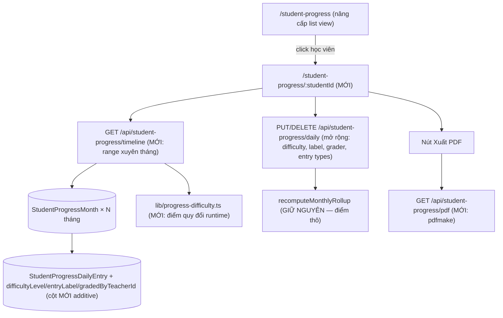

# Student Progress Dashboard V3 — Plan triển khai chi tiết

> **Ngày lập:** 2026-08-03
> **Pipeline đã chạy:** research (codebase + external) → sequential-thinking → brainstorm (4 quyết định đã chốt với chủ dự án) → ck-predict (5 persona) → plan
> **Trạng thái:** IMPLEMENTED — PRODUCTION LIVE (2026-08-06)
> **Track ID đề xuất:** `SPD-2026-08-*` (Student Progress Dashboard)

---

## PHẦN 1 — VẤN ĐỀ & MỤC TIÊU

### 1.1 Vấn đề hiện tại (theo phản ánh của chủ dự án)

Phần tiến bộ học viên (`/student-progress`) hiện nhập liệu **thủ công và bất tiện**, danh sách học viên **quá chung chung**, không nhìn được:
- Tổng quan nhanh từng học viên ngay trên danh sách
- Sự tiến bộ theo **từng ngày** qua bài tập/bài thi thử (có độ khó khác nhau)
- Insight: kỹ năng nào cần cải thiện, thế mạnh ở đâu, hôm nay tốt hơn hôm qua thế nào
- Báo cáo đẹp gửi phụ huynh theo tuần/tháng/năm

### 1.2 Mục tiêu (4 yêu cầu)

1. **List view giàu thông số**: mỗi dòng học viên hiển thị tổng quan đủ để quét nhanh.
2. **Detail dashboard per-student**: bấm vào học viên → dashboard riêng, nhập điểm kỹ năng theo bài tập/bài thi thử **theo ngày**, kèm nhận xét/lưu ý; ngày mới nhập tiếp không ghi đè ngày cũ.
3. **Chart tiến bộ cộng dồn**: từng dòng cập nhật theo ngày, chart thể hiện tăng/giảm so với ngày trước theo từng kỹ năng.
4. **Filter tuần/tháng/năm + xuất PDF** gửi phụ huynh.

### 1.3 Bốn quyết định thiết kế ĐÃ CHỐT (2026-08-03)

| # | Quyết định | Lựa chọn đã chốt |
|---|-----------|------------------|
| D1 | Mô hình độ khó | **Theo track Cambridge**: Starters / Movers / Flyers / KET / PET — mỗi bài tập/đề gắn 1 cấp độ |
| D2 | Hiển thị điểm | **Cả hai**: điểm thô + điểm quy đổi trọng số độ khó (2 chế độ trên chart) |
| D3 | PDF | **Server-side pdfmake** (tái dùng font Roboto Unicode + printer của `lib/pdf.ts`) |
| D4 | Người nhập | **Admin + Receptionist** nhập thay giáo viên, có field "giáo viên chấm" (không xây teacher login đợt này) |

---

## PHẦN 2 — KẾT QUẢ RESEARCH

### 2.1 Hiện trạng codebase (đã khảo sát rất kỹ, có file:line)

**Nền tảng ĐÃ CÓ (tái dùng, không đập đi xây lại):**

| Thành phần | Hiện trạng | Vị trí |
|-----------|-----------|--------|
| Điểm kỹ năng theo ngày | ĐÃ CÓ — `StudentProgressDailyEntry`: entryDate, entryType (6 loại: homework/daily_practice/skill_assessment/mock_test/shield/note), skillKey, score 0–100, shieldCount, note | `prisma/schema.prisma:909-931` |
| 7 kỹ năng chuẩn | listening, speaking, reading, writing, homework, daily_practice, mock_test (nhãn tiếng Việt) | `lib/student-progress-assessment.ts:13-20,180-198` |
| Track Cambridge | starters/movers/flyers/ket/pet/unknown, auto-detect từ tên lớp | `lib/student-progress-assessment.ts:3-9,383-392` |
| Rollup ngày→tháng | average/latest/delta/count/focus per skill; ghi cache vào `StudentProgressMonth.dailyAverageScore/LatestScore/ScoreDelta/AssessmentCount` | `server/api/student-progress/daily.ts:122-215` |
| Semantics ghi theo ngày | PUT replace-per-date (xóa hết entries của đúng ngày đó rồi tạo lại) — ngày mới nhập tiếp không ảnh hưởng ngày cũ | `daily.ts:300-438` |
| Finalize/reopen bất biến | Tháng finalized khóa mọi edit (kể cả daily), reopen cần lý do ≥10 ký tự, có revision snapshot | `lib/student-progress-finalization.ts`, AUD-RM-007 |
| Invariant null ≠ 0 | Điểm trống là `missing_input`, KHÔNG BAO GIỜ coerce về 0 — bị khóa bởi 5 file test | `tests/student-progress-*.test.ts` |
| PDF pipeline | pdfmake + Roboto embedded (tiếng Việt chuẩn), printer + paper handling tái dùng được; phần template contract của phiếu thu KHÔNG tái dùng | `lib/pdf.ts:553` |
| recharts | Đã là dependency, có vendor chunk riêng | `frontend` |

**Khoảng trống (phải xây mới):**

| Gap | Chi tiết |
|-----|---------|
| Độ khó | KHÔNG tồn tại ở bất kỳ đâu (schema, validation, engine, UI) |
| Tên bài / giáo viên chấm | Daily entry không có label bài tập, không có field giáo viên chấm |
| Trang chi tiết per-student | Không có route riêng — chỉ có side panel trên trang tổng |
| Chart per-student theo ngày | Không có — timeline hiện tại là LIST text, chart hiện tại toàn cohort-level theo tháng |
| Filter tuần/năm | Chỉ có month-range; daily endpoint chỉ nhận 1 tháng hoặc 1 ngày |
| Query xuyên tháng | Grain là student×class×**month** — xem theo năm phải gộp nhiều month records |
| PDF tiến bộ | Chưa có — đang dùng popup HTML + `window.print()` |
| UI cho homework/daily_practice/mock_test | API nhận nhưng UI hiện chỉ ghi skill_assessment/shield/note |
| RBAC | Cả 3 endpoint đang admin-only; quyết định D4 cần mở cho receptionist |

### 2.2 Best practices bên ngoài (2 nguồn nghiên cứu, đã đối chiếu)

1. **Dashboard tiến bộ học viên** (DEV/IXL/GitNexa/Nearpod/Springer 2026):
   - Ưu tiên **xu hướng, không phải snapshot** — line chart theo thời gian per-skill là trung tâm.
   - **Giới hạn ~5 metric chính** ở list view; drill-down mới xem chi tiết (đúng mô hình list → detail dashboard của yêu cầu).
   - **Cảnh báo tự động**: flag học viên khi điểm giảm >15% so với trung bình trước đó — đưa vào list view.
   - Bảng growth: điểm bắt đầu → hiện tại → tăng bao nhiêu (IXL Diagnostic Growth pattern) — áp dụng cho header detail dashboard.
   - Nhất quán màu/scale giữa các chart.
2. **Xử lý độ khó** (IRT/Rasch academic + thực dụng):
   - Chuẩn học thuật là IRT/Rasch — **quá phức tạp cho trung tâm** (YAGNI). Cách thực dụng được dùng rộng rãi: **trọng số cố định theo cấp độ đề** (weighted composite), giữ điểm thô làm sự thật gốc.
   - Kết hợp D1+D2: lưu điểm thô + tag cấp độ Cambridge của đề; điểm quy đổi = display-layer, tính runtime, **không ghi đè dữ liệu gốc**.

---

## PHẦN 3 — THIẾT KẾ GIẢI PHÁP (brainstorm đã hội tụ)

### 3.1 Các phương án đã cân nhắc và loại

| Phương án | Lý do loại |
|-----------|-----------|
| A. Bảng mới `ExerciseResult` tách khỏi daily entries | Vi phạm DRY/KISS — trùng 90% với `StudentProgressDailyEntry` đã có rollup + test + invariant. Chọn mở rộng bảng hiện có (additive columns). |
| B. IRT/adaptive scoring | YAGNI — trung tâm nhỏ, giáo viên chấm tay; trọng số tĩnh theo cấp độ là đủ và giải thích được với phụ huynh. |
| C. Lưu điểm quy đổi vào DB | Nguy hiểm — nếu đổi công thức trọng số phải migrate lại data; vi phạm nguyên tắc điểm thô là sự thật duy nhất. Tính runtime. |
| D. Teacher login đợt này | Chủ dự án đã chốt KHÔNG (D4) — scope auth lớn, làm phase riêng sau. |

### 3.2 Kiến trúc được chọn



### 3.3 Mô hình độ khó (D1 + D2)

- Mỗi entry loại `skill_assessment` / `mock_test` / `homework` / `daily_practice` gắn `difficultyLevel` = cấp độ Cambridge của **đề/bài** (starters..pet). Mặc định khi nhập = track của lớp (nhập nhanh, 1 chạm).
- **Trọng số tương đối** so với track của lớp: thứ bậc starters=1, movers=2, flyers=3, ket=4, pet=5.
  - `delta = level(bài) − level(lớp)`; `weight = 1 + 0.15 × delta`, clamp `[0.7, 1.3]`.
  - `weightedScore = min(100, score × weight)` — hằng số đặt trong `lib/progress-difficulty.ts`, có test khóa công thức, đổi công thức chỉ đổi 1 nơi.
  - Ví dụ: học viên lớp Movers làm đề Flyers được 80 → weighted = 80 × 1.15 = 92 ("làm đề khó hơn trình lớp mà vẫn 80 điểm"). Làm đề Starters được 80 → weighted = 68.
- **Điểm quy đổi CHỈ ở display-layer** (chart, bảng, PDF — luôn kèm điểm thô). Rollup tháng, `progressScore`, readiness **giữ nguyên tính trên điểm thô** — không đụng chuỗi precedence `daily_rollup` hiện có, không phá 5 file test invariant.
- Lớp `unknown` track: weight = 1.0 cố định, UI hiển thị nhắc "lớp chưa xác định track".

### 3.4 Verdict ck-predict (5 persona)

**Verdict: CAUTION — làm được, có 6 rủi ro phải xử lý trong plan.**

| Chủ đề | Architect | Security | Performance | UX | Devil's Advocate | Giải quyết |
|--------|-----------|----------|-------------|-----|------------------|-----------|
| Mở RBAC receptionist | Đổi contract 3 endpoint đang admin-only | Receptionist thấy được dữ liệu học tập — chấp nhận được; NHƯNG reopen finalized + xem revision phải GIỮ admin-only | — | Receptionist nhập nhanh hơn = mục tiêu chính | Có cần không? → Có, D4 đã chốt | Ma trận quyền chi tiết ở 4.2; test 403 từng action |
| Timeline xuyên tháng (view năm) | Grain month là đúng, chỉ cần endpoint gộp | — | View năm = 12 month records × ~30 entries × 7 skills ≈ vài nghìn điểm dữ liệu — PHẢI aggregate server-side theo tuần/tháng khi range dài, không trả raw về client | Chart 365 điểm không đọc được | Có ai xem view năm thật không? | Endpoint timeline tự chọn granularity: range ≤ 45 ngày → theo ngày; ≤ 6 tháng → theo tuần; hơn → theo tháng |
| Điểm quy đổi | Runtime-only, đúng | — | Tính nhẹ, O(n) entries | Phụ huynh có thể bối rối 2 con số | Weight 0.15 là số bịa — ai kiểm chứng? | Chart mặc định ĐIỂM THÔ, toggle sang weighted; PDF ghi chú thích công thức 1 dòng; hằng số có thể tinh chỉnh sau khi dùng thực tế |
| Finalized months trong range | Timeline đọc được cả tháng finalized (read OK), edit bị khóa | Đúng invariant AUD-RM-007 | — | Phải hiện badge khóa rõ trên từng segment/ngày thuộc tháng finalized | — | UI disable editor theo tháng của ngày được chọn; test khóa |
| PDF chart | pdfmake không vẽ chart phức tạp | — | Render bảng thay chart = nhẹ | Phụ huynh thích hình | Bảng số + sparkline ký tự (▁▃▅▇) đủ chưa? | Phase đầu: bảng tổng kết + bảng tiến bộ theo kỳ + delta mũi tên; chart-as-image để backlog (cần headless render, nặng) |
| Nhập liệu vẫn thủ công? | — | — | — | Form mới phải NHANH hơn cũ: default difficulty = track lớp, quick chips ngày điểm danh (đã có), copy điểm ngày trước, nhập theo hàng kỹ năng | Nếu form chậm hơn thì feature thất bại | UX requirements ở 4.4; E2E đo số thao tác |

**STOP triggers đã kiểm tra:** không có — không phá invariant tài chính/tiến bộ nào, schema thuần additive, không đụng đường tiền.

---

## PHẦN 4 — PLAN TRIỂN KHAI (5 phase, track SPD)

> **Nguyên tắc kế thừa từ `Audit_V2.md` Phần V:** áp dụng nguyên LOOP-1..LOOP-5, quy tắc bằng chứng V.5, và metric M-01..M-17 (baseline test hiện tại 467 root / 35 frontend — không được giảm). Các TC mới của feature này đánh số `TC-SPD-*`.
> **Ràng buộc bất khả xâm phạm:** (1) null ≠ 0; (2) finalized month bất biến, reopen admin-only có lý do; (3) daily replace-per-date semantics giữ nguyên; (4) rollup/progressScore tính trên điểm thô; (5) schema chỉ additive.

### PHASE SPD-A — Schema + Difficulty Engine (owner: `database-architect` + `backend-specialist`)

- [x] **SPD-A1 — Migration additive cho daily entries**
  - **Việc:** Thêm vào `StudentProgressDailyEntry`: `difficultyLevel String?` (giá trị starters/movers/flyers/ket/pet — String như `trackKey` hiện có, KHÔNG enum DB để khỏi migration enum sau này), `entryLabel String?` (tên bài tập/đề, ≤200 ký tự), `gradedByTeacherId String?` FK → `Teacher` (onDelete SetNull) + index. 1 migration `2026XXXX_progress_daily_difficulty`.
  - **Cách:** Cột nullable → toàn bộ rows cũ hợp lệ, không backfill. Cập nhật schema.prisma + `npx prisma validate` + test isolated + `migrate deploy`.
  - **Nghiệm thu:** `migrate status` clean; rows cũ đọc bình thường; TC-SPD-01.
- [x] **SPD-A2 — `lib/progress-difficulty.ts` (engine trọng số)**
  - **Việc:** Hàm `getDifficultyWeight(entryLevel, classTrackKey)` (thứ bậc 1..5, delta × 0.15, clamp 0.7–1.3, unknown → 1.0) và `computeWeightedScore(score, weight)` (min 100, làm tròn 1 chữ số). Export bảng hằng số để UI/PDF dùng chung chú thích.
  - **Nghiệm thu:** Unit test khóa từng cặp level (5×5 ma trận + unknown + null score → null); TC-SPD-02.
- [x] **SPD-A3 — Mở rộng validation + daily API**
  - **Việc:** `lib/validation.ts`: schema daily entry thêm `difficulty_level` (optional, enum 5 giá trị), `entry_label` (optional, max 200), `graded_by_teacher_id` (optional, cuid). `daily.ts` PUT/GET đọc-ghi 3 field mới (snake_case DTO). Entry types homework/daily_practice/mock_test giữ nguyên validation hiện có — UI sẽ expose ở Phase C.
  - **Nghiệm thu:** Payload cũ (không có field mới) vẫn hợp lệ 100% (backward compat); payload sai enum → `VALIDATION_ERROR`; TC-SPD-03.
- [x] **SPD-A4 — RBAC theo ma trận quyền**
  - **Việc:** Đổi `requireAuth(handler, ["admin"])` → `["admin","receptionist"]` cho: GET/PUT/DELETE `/student-progress/daily`, GET + upsert `/student-progress`, GET `/reports/student-progress`. **GIỮ admin-only:** action `reopen`, và finalize (upsert với `finalized: true`). Frontend route đổi `AdminOnly` → `ProtectedRoute` cho `/student-progress` (sidebar bỏ cờ adminOnly tương ứng).
  - **Nghiệm thu:** Test 403/200 từng cell của ma trận quyền (receptionist reopen → 403, receptionist nhập daily → 200...); TC-SPD-04.

**DoD Phase A:** migration deploy sạch, engine + validation có test, RBAC đúng ma trận, full suite không giảm, receipt + memory write-back.

### PHASE SPD-B — Timeline API xuyên tháng (owner: `backend-specialist`)

- [x] **SPD-B1 — `GET /api/student-progress/timeline` (endpoint mới)**
  - **Việc:** Params: `student_id`, `class_id` (bắt buộc), `from`, `to` (ISO date, half-open UTC — dùng convention đã chuẩn ở Audit_V2 P2-04). Gộp daily entries của mọi `StudentProgressMonth` trong range. Response: (a) `days[]` — mỗi ngày: entries đầy đủ (kèm difficulty/label/grader), per-skill raw + weighted, tổng điểm ngày, delta so với ngày-có-dữ-liệu liền trước, cờ `month_finalized`; (b) `series` — per-skill time-series đã aggregate theo granularity; (c) `summary` — điểm đầu kỳ, cuối kỳ, tăng trưởng per skill (IXL growth pattern), điểm cộng dồn (cumulative pointsTotal), focus skill, cảnh báo giảm >15%; (d) `granularity` server tự chọn: range ≤45 ngày → `day`, ≤186 ngày → `week` (ISO week), hơn → `month`.
  - **Cách:** Query `StudentProgressMonth` theo `month in [...]` + include daily entries filter `entryDate` range; aggregate in-memory theo pattern Bulk Aggregation của dự án. Weighted tính qua `lib/progress-difficulty.ts` với track lớp tại thời điểm đọc. Null score không bao giờ thành 0 trong series (bỏ điểm khỏi series, không vẽ 0).
  - **Nghiệm thu:** TC-SPD-05 (range 1 tuần trả granularity day, đúng delta), TC-SPD-06 (range 1 năm trả granularity month, số điểm dữ liệu ≤ 12/skill), TC-SPD-07 (tháng finalized có cờ, null không thành 0), RBAC admin+receptionist.
- [x] **SPD-B2 — Bổ sung metric list view vào report API**
  - **Việc:** `/api/reports/student-progress` mỗi row bổ sung (từ cache có sẵn trên month record — KHÔNG query thêm): `daily_average_score`, `daily_latest_score`, `daily_score_delta`, `daily_assessment_count`, `last_entry_date`, `alert_score_drop` (true khi latest < 0.85 × average của kỳ trước đó — theo research 15%).
  - **Nghiệm thu:** TC-SPD-08 — row DTO có đủ field, alert đúng ngưỡng, không tăng số query (đo bằng test đếm query hoặc select narrow).

**DoD Phase B:** endpoint mới có docs trong `docs/API.md` (drift test pass), unit tests granularity/delta/alert, receipt.

### PHASE SPD-C — Frontend: List view + Detail Dashboard (owner: `frontend-specialist`, review: `qa-automation-engineer`)

- [x] **SPD-C1 — Nâng cấp list view `/student-progress`**
  - **Việc:** Bảng thêm cột (giới hạn 5 metric chính theo research): Điểm TB kỳ này + mũi tên delta (▲▼ màu theo chiều), Số bài đã chấm, Lần chấm cuối, Kỹ năng cần chú ý (focus), Badge cảnh báo "Giảm >15%". Click dòng → navigate `/student-progress/:studentId?class_id=...` (thay cho mở side panel như hiện tại; side panel monthly editor cũ chuyển vào trang chi tiết).
  - **Nghiệm thu:** TC-SPD-09 (E2E: list hiển thị metric, click điều hướng đúng); không vỡ CSV export/print cũ.
- [x] **SPD-C2 — Trang mới `StudentProgressDetailPage` (`/student-progress/:studentId`)**
  - **Việc:** Route `ProtectedRoute` (admin + receptionist). Layout: (1) Header học viên: tên, lớp/track, readiness, growth summary đầu kỳ→cuối kỳ; (2) Thanh filter kỳ: Tuần / Tháng / Năm / Tùy chọn (mặc định: tháng hiện tại) + nút Xuất PDF; (3) Khu chart (SPD-C3); (4) Timeline bảng theo ngày (SPD-C4); (5) Editor nhập theo ngày (SPD-C5). Loading/error/retry theo pattern `useAsyncData`; mọi fetch qua timeline API + daily API.
  - **Nghiệm thu:** TC-SPD-10 (E2E route load, filter đổi kỳ gọi API đúng params, 0 console error).
- [x] **SPD-C3 — Khu chart (recharts, tối đa 4 panel)**
  - **Việc:** (1) LineChart per-skill theo thời gian — chọn kỹ năng hiển thị, toggle "Điểm thô / Quy đổi độ khó" (mặc định thô, D2); (2) AreaChart điểm cộng dồn (cumulative pointsTotal theo ngày — "cộng dần, tăng dần" đúng yêu cầu); (3) Bar delta so với lần trước cho lần cập nhật gần nhất (7 kỹ năng, xanh tăng/đỏ giảm); (4) Radar 7 kỹ năng trung bình kỳ này vs kỳ trước. Điểm null KHÔNG vẽ (gap trong line, không vẽ 0). Màu/scale nhất quán giữa 4 panel và PDF.
  - **Nghiệm thu:** TC-SPD-11 (E2E: toggle weighted đổi dữ liệu chart; ngày thiếu điểm tạo gap không phải 0).
- [x] **SPD-C4 — Timeline bảng theo ngày**
  - **Việc:** Mỗi dòng = 1 ngày có dữ liệu: các entry (loại + tên bài + cấp độ đề + giáo viên chấm), điểm per-skill (thô + weighted nhỏ bên cạnh), delta vs ngày trước (mũi tên), khiên, ghi chú. Dòng thuộc tháng finalized có badge khóa 🔒 và không mở editor. Click dòng → mở editor ngày đó (SPD-C5). Phân trang/virtualize khi range dài.
  - **Nghiệm thu:** TC-SPD-12 (delta đúng giữa 2 ngày liên tiếp có dữ liệu; ngày finalized không edit được).
- [x] **SPD-C5 — Editor nhập theo ngày (nâng cấp `DailyProgressEditor`)**
  - **Việc:** Mở rộng editor hiện có: (1) chọn loại bài: Bài tập (homework) / Luyện hằng ngày (daily_practice) / Kiểm tra kỹ năng (skill_assessment) / Thi thử (mock_test) — expose đủ 4 loại chấm điểm mà API đã hỗ trợ; (2) field Tên bài/đề (entry_label); (3) select Cấp độ đề — **mặc định = track của lớp** (1 chạm nếu đúng trình); (4) select Giáo viên chấm (danh sách Teacher active); (5) giữ nguyên: grid 7 kỹ năng "để trống = chưa có dữ liệu", khiên, ghi chú bắt buộc cho ngày không điểm danh, quick chips ngày điểm danh; (6) MỚI — nút "Chép điểm lần trước" (copy entries của ngày có dữ liệu gần nhất làm khởi điểm, giáo viên chỉ sửa số) để giảm thao tác nhập.
  - **Nghiệm thu:** TC-SPD-13 (E2E: nhập 1 bài thi thử cấp KET cho học viên lớp Flyers → lưu → timeline hiện đúng label/cấp độ/weighted; ngày mới nhập tiếp không mất ngày cũ — replace-per-date được giữ); TC-SPD-14 (đếm thao tác: nhập 1 ngày điển hình ≤ 12 click/field — phải NHANH hơn flow cũ).

**DoD Phase C:** lint zero warnings, E2E TC-SPD-09..14 pass 2 lần liên tiếp (LOOP-3), UX baseline không vỡ, deploy + production Chrome smoke read-only, receipt.

### PHASE SPD-D — PDF gửi phụ huynh (owner: `backend-specialist` + `frontend-specialist`)

- [x] **SPD-D1 — `GET /api/student-progress/pdf`**
  - **Việc:** Params như timeline (`student_id`, `class_id`, `from`, `to`). Xây docDefinition pdfmake thuần (KHÔNG qua template contract của phiếu thu — chỉ tái dùng fonts/printer/paper A4 từ `lib/pdf.ts`): (1) header trung tâm từ `CenterSettings` + tiêu đề "BÁO CÁO TIẾN BỘ HỌC VIÊN" + kỳ báo cáo; (2) thông tin học viên/lớp/track/phụ huynh; (3) bảng tổng kết 7 kỹ năng: điểm đầu kỳ → cuối kỳ → tăng trưởng (mũi tên ▲▼), cột điểm quy đổi kèm chú thích công thức 1 dòng; (4) bảng chi tiết theo granularity (ngày/tuần/tháng tùy range) với sparkline ký tự ▁▃▅▇ per skill; (5) nhận xét giáo viên + parentSummary + focus/khuyến nghị; (6) footer ngày in + người in. Điểm thiếu in "—" tuyệt đối không in 0. RBAC admin + receptionist.
  - **Nghiệm thu:** TC-SPD-15 (PDF trả `application/pdf`, magic bytes `%PDF`, có `/ToUnicode` + Roboto — tiếng Việt không vỡ, theo pattern test PDF phiếu thu hiện có); TC-SPD-16 (nội dung: học viên thiếu điểm 1 kỹ năng → ô "—").
- [x] **SPD-D2 — Nút xuất PDF trên detail page**
  - **Việc:** Nút "Xuất PDF gửi phụ huynh" trên header detail dashboard dùng authenticated blob fetch qua `utils/pdfPrint.js` (pattern phiếu thu) — mở/tải file theo đúng kỳ filter đang chọn. Giữ nút print HTML cũ ở trang list như phương án nhanh (không xóa).
  - **Nghiệm thu:** TC-SPD-17 (E2E: click → nhận blob PDF, không popup trắng).

**DoD Phase D:** PDF production smoke với 1 học viên thật (read-only), docs/API.md cập nhật, receipt.

### PHASE SPD-E — Test tổng, deploy, closeout (owner: `test-engineer` + `release-manager`)

- [x] **SPD-E1 — Regression invariant cũ**: chạy nguyên 5 file test student-progress hiện có + full suite — null≠0, finalize/reopen, replace-per-date, precedence daily_rollup KHÔNG đổi hành vi. Bổ sung test: entry có difficulty không làm thay đổi rollup tháng (rollup vẫn điểm thô).
- [x] **SPD-E2 — E2E tổng hợp** `frontend/e2e/student-progress-dashboard.spec.js`: login → list có metric mới → vào detail → nhập 2 ngày liên tiếp (1 homework Flyers + 1 mock_test KET) → chart/delta/cumulative đúng → filter tuần/tháng/năm → xuất PDF → reload giữ dữ liệu. Chạy trên local smoke server, 2 lần sạch (LOOP-3).
- [x] **SPD-E3 — Deploy + production smoke**: gates đầy đủ (M-01..M-12 của Audit_V2) → deploy → authenticated Chrome: `/student-progress` list mới, detail page 1 học viên thật (read-only), PDF 200. Rollback theo LOOP-4 nếu blocking metric fail. Production cuối: `dpl_215rbfRy5TrpY8UMZpEb6LoPXGys`, alias `https://edu-manager-gules.vercel.app`.
- [x] **SPD-E4 — Write-back**: KANBAN section SPD-2026-08, activeContext, progress append, decisionLog (D1..D4 + công thức trọng số), receipt `receipts/2026-08-06-student-progress-dashboard-closeout.md` với bảng TC-SPD-01..17.

### Trình tự & phụ thuộc

```
SPD-A (schema/engine/RBAC) → SPD-B (timeline API) → SPD-C (UI) → SPD-D (PDF) → SPD-E (closeout)
```
- A phải xong trước B (B đọc cột mới); C phụ thuộc B (chart ăn timeline API); D độc lập với C sau khi B xong (có thể song song C nếu 2 agent); E cuối cùng.
- **Nếu Audit_V2 Phase 2 (UTC helper) chưa làm:** SPD-B1 tự tạo helper UTC half-open cục bộ theo cùng convention, ghi chú hợp nhất sau — không block lẫn nhau.

---

## PHẦN 5 — TEST CASES & METRICS RIÊNG CỦA FEATURE

### Test cases (tóm tắt — chi tiết đã gắn trong từng todo)

| TC | Loại | Nội dung chính |
|----|------|----------------|
| TC-SPD-01 | I | Migration additive: rows cũ đọc bình thường, cột mới nullable |
| TC-SPD-02 | U | Ma trận trọng số 5×5 + unknown + null; clamp 0.7–1.3; weighted ≤ 100 |
| TC-SPD-03 | U | Backward compat payload cũ; enum sai → VALIDATION_ERROR |
| TC-SPD-04 | U | Ma trận RBAC: receptionist daily 200, reopen 403, finalize 403 |
| TC-SPD-05..07 | U/I | Timeline: granularity theo range, delta đúng, finalized flag, null≠0 |
| TC-SPD-08 | U | List metric + alert giảm >15%, không tăng query |
| TC-SPD-09..14 | E | List → detail → chart toggle → timeline → editor → đếm thao tác nhập |
| TC-SPD-15..17 | U/I/E | PDF Unicode/ToUnicode/Roboto, ô "—" cho missing, blob fetch |

### Metrics bổ sung (ngoài M-01..M-17 kế thừa)

| Metric | Ngưỡng | Loại |
|--------|--------|------|
| M-SPD-01: Thao tác nhập 1 ngày điển hình (7 kỹ năng + 1 bài) | ≤ 12 click/field, nhanh hơn flow cũ (đo trong E2E) | Blocking |
| M-SPD-02: Timeline API view năm | ≤ 12 điểm dữ liệu/skill trả về; response < 2s local | Blocking |
| M-SPD-03: Invariant cũ | 5 file test student-progress pass nguyên vẹn, 0 sửa assertion | Blocking |
| M-SPD-04: PDF tiếng Việt | `%PDF` + `/ToUnicode` + Roboto, mở được bằng viewer chuẩn | Blocking |
| M-SPD-05: Chart null-gap | 0 điểm nào vẽ giá trị 0 từ dữ liệu null | Blocking |

---

## PHẦN 6 — RỦI RO & BIÊN GIỚI SCOPE

| Rủi ro | Mức | Giảm thiểu |
|--------|-----|-----------|
| Đổi hành vi route `/student-progress` từ AdminOnly → cả receptionist | Trung bình | Ma trận RBAC + test 403; reopen/finalize vẫn admin-only |
| Trọng số 0.15 chưa được kiểm chứng thực tế | Thấp | Display-only, hằng số 1 nơi, tinh chỉnh sau khi dùng 1 tháng; điểm thô là mặc định |
| Phụ huynh hiểu nhầm điểm quy đổi | Thấp | PDF/chart mặc định điểm thô; quy đổi luôn kèm chú thích |
| Range dài làm chậm serverless (cold start Neon) | Trung bình | Aggregate server-side, select narrow, granularity tự động |
| Xung đột file với Audit_V2 Phase 3 (nếu chạy song song) | Thấp | 2 track đụng file khác nhau (progress vs receipts/history/fee); chạy tuần tự nếu cùng agent |

**NGOÀI scope đợt này (backlog, không tự ý làm):** teacher login; chart render thành hình trong PDF; ngân hàng đề/bài tập (exercise bank) có mã đề dùng lại; parent portal xem dashboard trực tiếp; IRT/adaptive; notification tự động cho phụ huynh.

---

## PHẦN 7 — CHECKLIST DUYỆT TRƯỚC KHI THỰC THI

- [x] Chủ dự án duyệt công thức trọng số (delta × 0.15, clamp 0.7–1.3).
- [x] Chủ dự án duyệt việc `/student-progress` mở cho receptionist (route + 3 endpoint, trừ reopen/finalize).
- [x] Chủ dự án duyệt bố cục PDF (mục 4 SPD-D1).
- [x] Audit_V2 đã closeout production trước khi bắt đầu track SPD.
