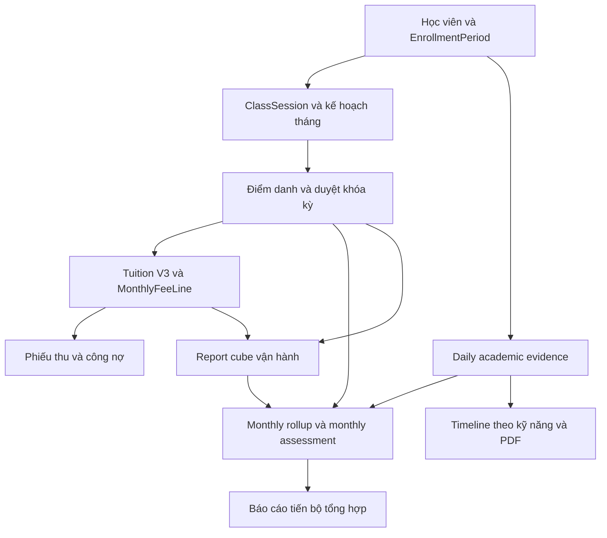

# Rà soát hệ thống EDU_MANAGER_V2

Ngày: 2026-10-05. Task: REV-20261005-01.
Đối tượng: working tree hiện tại trên `main`, HEAD `712cc6662b88ed20b747d52ee9598ce5553ac3e9`, bao gồm thay đổi Admin Console chưa commit.

## 1. Kết luận và giới hạn

Đã xác định kiến trúc, đường đi dữ liệu và công thức chính của học phí, đánh giá tháng và timeline tiến bộ. Có 5 nhóm sai lệch đáng xử lý bên dưới. Đây là kết quả đọc code và chạy domain probes cục bộ, không phải xác nhận lỗi trên production hoặc chứng nhận toàn hệ thống đạt quality gates.

Rà soát toàn bộ repository còn PARTIAL vì OneDrive không cung cấp được nhiều file. Kiểm kê metadata trong phiên: `frontend/src` có 68/102 file text mang cờ RecallOnDataAccess; `docs` 162/169; `plans` 12/16; `receipts` 101/103; `lib` 6/62; `server` 5/84. Các số này là snapshot cờ filesystem, không phải số file đã đọc hoặc số lỗi. Một số file có thể được hydrate trong lúc kiểm tra.

Full unit suite phát sinh `UNKNOWN: unknown error, read` trong dependency `undici`; typecheck không hoàn tất. Các lệnh chờ đã được dừng. Không sửa production code, không truy vấn dữ liệu học viên, không migrate/deploy hay thay đổi cấu hình toàn máy.

## 2. Những vấn đề ưu tiên

### R1 [P1] Buổi extra thu thêm có thể thành miễn phí ở lớp tính theo buổi

- Nguồn: `lib/tuition-v3-service.ts:109`, `lib/tuition-settings.ts:74`, `lib/tuition-v3.ts:238`.
- Service truyền `monthlyAmount = 0` khi `billingPolicy = per_session`; cấu hình mặc định `extraSessionPolicy = derive_monthly` chia số 0 cho số buổi regular. Engine nhận surcharge bằng 0 và chuyển extra sang `included_extra` dù đầu vào ghi `surcharge`.
- Tái hiện: 90.000đ/buổi; một regular present và một extra present/surcharge. Kết quả hiện tại 90.000đ, extra 0đ. Nếu surcharge theo đơn giá buổi thì phải là 180.000đ.
- Bằng chứng: `tuition-probe.ts`, chạy trên service thực, exit 0 với assertions xác nhận hành vi lỗi. Không phải test chứng minh hệ thống đúng.
- Hướng xử lý: định nghĩa phụ thu theo từng billing mode, test cả per-session/monthly và included/surcharge trước khi sửa.

### R2 [P1] Trend tháng so sánh hai loại điểm khác nhau

- Nguồn: `lib/student-progress-report.ts:259-261`, `:290-297`.
- `previousByKey` lưu điểm proxy chuyên cần/nhất quán; hàng hiện tại có dữ liệu học thuật lại trừ điểm học thuật cho proxy đó.
- Tái hiện: tháng trước điểm học thuật 60, tháng này 80; cả hai tháng chuyên cần 100. Hệ thống trả delta −20 và `declining`, trong khi chênh lệch hai điểm học thuật là +20.
- Hướng xử lý: lưu điểm cuối cùng thực sự hiển thị và nguồn điểm của từng kỳ; chỉ tính trend khi nguồn/chỉ số so sánh phù hợp. Cần xử lý riêng kỳ đầu trong filter và chuyển từ proxy sang academic.

### R3 [P1] Dữ liệu ngày không được dùng nhất quán trong đánh giá tháng

- Nguồn: `server/api/student-progress/daily.ts:166`, `lib/student-progress-assessment.ts:470`, `server/api/student-progress/index.ts:641-659`.
- Daily API lưu rollup vào các cột riêng, cố ý không ghi đè điểm tháng do giáo viên nhập. Nhưng assessment tháng chỉ lấy điểm kỹ năng từ `progressMonth.skills`, không từ daily entries hoặc daily rollup.
- Tái hiện domain: có daily Listening 80 và persisted `progressScore = 80`; assessment trả điểm tổng 80 nhưng cả 7 kỹ năng đều thiếu điểm.
- Rủi ro ở đường monthly upsert/finalize: snapshot mới không giữ persisted `progressScore`; nếu không có monthly skill scores thì engine dùng proxy chuyên cần. Với cùng daily evidence 80 và chuyên cần đầy đủ, tính lại ra 100. Đây là tái hiện hàm tính và đối chiếu code handler; chưa chạy HTTP finalize/DB round-trip trong phiên.
- Hướng xử lý: quy định rõ precedence manual monthly > daily rollup > operational fallback, áp dụng nhất quán cho report, upsert và finalize; thêm kiểm tra bảo toàn daily-only score khi chốt tháng.

### R4 [P2] Delta tổng ngày/tháng có thể đo thay đổi kỹ năng được chấm

- Nguồn: `lib/student-progress-assessment.ts:280-301`; `lib/student-progress-timeline.ts:139-142`.
- Rollup tổng lấy điểm entry đầu/cuối của mọi kỹ năng, không phải cùng kỹ năng hay cùng bộ kỹ năng. Trong cùng ngày, thứ tự entries cũng có thể quyết định latest/delta.
- Tái hiện: Nghe 90 ngày 1, Nói 50 ngày 2 => delta tổng −40; mỗi kỹ năng mới có một lần chấm và delta riêng đều 0. Không đủ bằng chứng để nói năng lực giảm 40 điểm.
- Timeline dùng trung bình các kỹ năng có điểm mỗi ngày nên vẫn có rủi ro khi tập kỹ năng thay đổi, dù không giống phép lấy entry cuối của rollup.
- Hướng xử lý: ưu tiên trend cùng kỹ năng; chỉ so điểm tổng khi có bộ kỹ năng tương đương, kèm số lần chấm và coverage.

### R5 [P2] Academic settings chưa đi xuyên tới timeline/PDF

- Nguồn: `lib/progress-difficulty.ts:25`, `lib/student-progress-timeline.ts:130`, `server/api/student-progress/timeline.ts:98`, `server/api/student-progress/pdf.ts:60`.
- Hàm difficulty đã nhận settings, nhưng timeline không có tham số settings và các endpoint timeline/PDF không tải academic config theo tháng.
- Tái hiện: override delta 0,30 cho đề Flyers/lớp Movers cho hệ số 1,30; timeline với điểm 80 vẫn tính 92 theo mặc định 1,15, thay vì 100 sau cap.
- Phạm vi: sai lệch của bản Admin Console local đang phát triển. Không suy ra production đã bật setting này.
- Hướng xử lý: truyền effective-month settings hoặc snapshot đã chốt xuyên suốt report/timeline/PDF; kiểm tra lịch sử trước/sau thay đổi cấu hình.

## 3. Hệ thống phục vụ ai và vận hành thế nào

Đây là ứng dụng vận hành trung tâm đào tạo: hồ sơ học viên/phụ huynh/giáo viên, lớp và lịch, ghi danh, điểm danh, học phí, phiếu thu/chi, báo cáo, mẫu in/PDF, backup và nhật ký. Student Progress bổ sung evidence học tập theo ngày và báo cáo theo kỳ.

Runtime theo cấu trúc và tài liệu đang có: React 19/Vite/React Router -> `api/router.ts` -> `server/api/*` -> `lib/*` -> Prisma/PostgreSQL. `backend/` Express/SQLite là reference, không phải đường production cần dùng để kết luận nghiệp vụ.

Tài khoản nhân viên có `admin` và `receptionist`; local Admin Console bổ sung permission catalog, tenant-scoped request database và Platform Owner. JWT được đối chiếu session/user/tokenVersion/tenant, không chỉ decode. Parent portal có xác thực riêng, đọc dữ liệu con của phụ huynh; handler hiện đọc học phí/phiếu thu/điểm danh, không nên mặc định rằng nó đã cung cấp toàn bộ dashboard học thuật.

## 4. Cơ chế tính tiền

### Đơn vị tính và dữ liệu gốc

- `Class.billingPolicy`: `monthly_prorated` hoặc `per_session`.
- Tên trường `feePerDay` là legacy: ở monthly mode nó mang học phí THÁNG, ở per-session mode nó mang học phí BUỔI. UI Classes đã đổi nhãn theo mode.
- `ClassSession` là ledger buổi học: regular, makeup, extra; có billingMonth, trạng thái và liên kết buổi bù.
- `EnrollmentPeriod` giới hạn quyền lợi theo thời gian `[startedAt, endedAt)`. `StudentClass` là projection hiện tại; lịch sử enrollment được ưu tiên khi tính phí.
- `MonthlyFeeLine` là học viên × lớp × tháng (thêm tenant trong local); `MonthlyFee` là tổng học viên × tháng. Thu tiền theo class line tránh gộp nhầm nhiều lớp.

### Gói tháng

Giả sử học phí tháng M và N buổi regular của tháng: engine phân bổ M vào N buổi. Mẫu số không phải số tuần hiển thị hoặc số buổi học viên có mặt. Làm tròn VND bằng `floor(M/N)` và rải phần dư vào các buổi đầu theo ngày/id; tổng đủ N buổi bằng đúng M.

Ví dụ 900.000đ, 10 buổi regular: đơn giá 90.000đ. Tính tiền 9 buổi => 810.000đ. Nếu đủ 10 buổi thuộc diện tính phí => 900.000đ. Học giữa tháng chỉ tính các buổi đủ điều kiện enrollment, nhưng mẫu số vẫn là kế hoạch lớp cả tháng.

### Trạng thái và buổi bổ sung

| Trường hợp | Hành vi mặc định trong Tuition V3 |
| --- | --- |
| present | Tính phí regular |
| absent_with_fee | Vẫn tính phí regular |
| absent_no_fee | Miễn phí regular |
| center_cancelled / holiday | Không tính regular nếu không có buổi bù hợp lệ trong tháng |
| Makeup cùng tháng thay regular miễn/credit | Ghi khoản thu ở regular gốc, không thu lần hai ở makeup |
| Makeup ngoài tháng | Engine có disposition riêng, không tự thu thêm; mapping service cần được kiểm chứng thêm |
| Extra included | Không thu thêm |
| Extra surcharge | Phụ thu theo settings; có lỗi R1 với per-session/default |

Tên hiển thị hiện tại gắn `absent_with_fee` với “Nghỉ có phép”, `absent_no_fee` với “Nghỉ không phép”. Đây là quyết định nghiệp vụ thực tế cần xác nhận với người vận hành, không tự đổi theo thông lệ suy đoán.

### Điều kiện chốt tiền và bảo vệ dữ liệu

Manual calculate/generator kiểm tra attendance period `locked` và month plan `frozen`. Thiếu regular plan ở gói tháng hoặc thiếu attendance cần thiết sẽ bị từ chối. Các đường ghi dùng transaction/Serializable/advisory locks để hạn chế race.

Fee line lưu calculation version/snapshot, số buổi eligible/delivered/credit/waived. Line confirmed/paid hoặc gắn receipt/receipt line được bảo vệ khỏi tính lại. Thu tiền tạo/liên kết phiếu thu trong transaction; bulk-pay có batch/idempotency/reconciliation. Phiếu chi (`Payment`) là tiền ra, khác với `Receipt` tiền vào.

Chưa chứng minh đầy đủ concurrency, cross-month makeup, restore hoặc SQL constraints bằng database thật trong phiên này.

## 5. Đánh giá học viên: ba lớp chỉ số khác nhau

### A. Chỉ số vận hành khi thiếu điểm học thuật

Trong report fallback hiện tại:

`A = clamp(0,72 × tỷ lệ có mặt + 0,28 × tỷ lệ hoàn tất điểm danh)`

`C = clamp(100 − 4 × buổi thiếu − 10 × absent_no_fee − 5 × absent_with_fee)`

`P_proxy = clamp(0,72 × A + 0,28 × C)`

Các đại lượng tỷ lệ dùng thang 0–100. Đây là proxy vận hành, không phải điểm năng lực tiếng Anh. Coverage fallback còn cộng theo sự tồn tại lịch, điểm danh và fee ledger (tối đa 75), nên cũng không đồng nghĩa coverage học thuật.

### B. Đánh giá tháng bằng điểm kỹ năng

Bảy domain: Nghe, Nói, Đọc, Viết, BTVN, Luyện hằng ngày, Bài kiểm tra/đề. Điểm được chuẩn hóa theo `score/max_score × 100`; thiếu điểm giữ null. Rubric chia lại theo tổng trọng số các kỹ năng thực sự có điểm.

Mặc định blend: `P_academic = 0,60 × skillScore + 0,25 × A + 0,15 × C`. Persisted `progressScore` được ưu tiên nếu tồn tại. Readiness mặc định: >=85 on_track, >=70 watch, thấp hơn needs_support; khi có risk chuyên cần dùng ngưỡng 78 để phân watch/needs_support; thiếu attendance basis => insufficient_data. Đây là quy tắc nội bộ, không phải chứng nhận Cambridge.

| Track | Nghe | Nói | Đọc | Viết | BTVN | Luyện ngày | Thi thử |
| --- | --- | --- | --- | --- | --- | --- | --- |
| Starters | 28 | 28 | 14 | 14 | 8 | 8 | 0 |
| Movers | 26 | 26 | 16 | 16 | 8 | 8 | 0 |
| Flyers | 22 | 22 | 18 | 18 | 10 | 10 | 0 |
| KET | 18 | 18 | 24 | 24 | 8 | 4 | 4 |
| PET | 16 | 16 | 26 | 26 | 8 | 4 | 4 |

Track thường suy ra từ tên lớp hoặc giá trị đã lưu. Local settings có thể thay rubric/threshold. Do override của track chứa toàn bộ trọng số, tác động của class-type base khi track đã biết cần được giải thích rõ cho admin.

### C. Rollup từ bài chấm theo ngày

`StudentProgressDailyEntry` lưu ngày, loại entry, kỹ năng, điểm, khiên, tên bài, cấp độ đề, độ khó mô tả, giáo viên chấm, ghi chú. PUT thay toàn bộ entries của đúng ngày, không phải append thêm một bài vào ngày đó. Ngày mới không xóa ngày cũ. Ngày không có attendance cần ghi chú; grader nếu cung cấp phải là giáo viên active đang phụ trách lớp.

Rollup kỹ năng chỉ nhận entries `skill_assessment`. Điểm tháng daily-only lấy trung bình điểm thô các entries đó; khi có manual monthly skill scores thì giữ score tháng trước đó. Số lượng entry theo kỹ năng ảnh hưởng trọng số thực tế của trung bình chung. Homework/mock-test loại riêng có ý nghĩa khác; không nên cho rằng mọi số score đều đi vào cùng rollup.

`pointsTotal` cộng các score; `shieldTotal` cộng khiên. Điểm cộng dồn tăng theo khối lượng chấm bài, không chứng minh năng lực tăng. `mockTestScore` có helper riêng, có thể suy từ skill entries của ngày có marker mock-test.

Finalize khóa sửa; reopen/finalize vẫn admin-only, reopen cần lý do và revision snapshot. R3 cần được kiểm tra ở HTTP/DB trước khi tin chốt tháng bảo toàn toàn bộ ý nghĩa điểm.

## 6. Theo dõi tiến bộ và xuất báo cáo

Trang tổng `/student-progress`: grain học viên × lớp × tháng, filter, tổng hợp, cảnh báo, export/print và liên kết detail. `/student-progress/:studentId` dùng timeline theo lớp/khoảng ngày. Phần UI chi tiết chưa đọc/kiểm tra đầy đủ do file chưa hydrate; chức năng giao diện nêu theo plan và route/API đã đọc.

Timeline trả các ngày có evidence, điểm thô/quy đổi từng kỹ năng, delta, cumulative points và so sánh với khoảng liền trước có cùng số ngày. Granularity: <=45 ngày dùng ngày; <=186 dùng tuần; dài hơn dùng tháng; giới hạn range 732 ngày. `from/to` API là ngày bao gồm cả hai đầu; query DB chuyển thành nửa mở bằng ngày kế tiếp của `to`.

`exam_set_level` = cấp độ bộ đề. `difficulty_level` = easy/medium/hard, hiện chỉ mô tả. Công thức mặc định: `weight = clamp(1 + 0,15 × (rank đề − rank lớp), 0,7, 1,3)`; `weightedScore = min(100, raw × weight)`. Movers làm Flyers đạt 80 => 92. Điểm quy đổi chỉ phục vụ trình bày; không phải thang điểm chuẩn hóa khoa học hay điểm Cambridge chính thức.

Cảnh báo giảm điểm cũng chưa đồng nhất: list so latest entry với average tháng trước; timeline so điểm tổng cuối kỳ với đầu kỳ. Cùng nhãn giảm >15% có thể dựa trên baseline khác nhau.

PDF gọi cùng timeline service, dùng pdfmake pipeline; chưa render PDF hoặc kiểm chứng font/browser trong phiên này. Report tháng và timeline chưa có cùng một hợp đồng chỉ số, thể hiện qua R2–R5.

## 7. Đối chiếu tài liệu và trạng thái triển khai

Đã đọc/đối chiếu các phần liên quan của KANBAN, activeContext, progress, decisionLog (đặc biệt ADR-49..58), current-session/handoff, techContext/systemPatterns, learned-patterns/error-catalog, PROJECT_CONTEXT, Student Progress Dashboard Plan, hai plan Student Progress tháng 6, Admin Console PRD/Execution Plan, API docs và USER_GUIDE; receipt Admin Console 2026-08-15 được đọc trực tiếp.

Các receipt release cũ, `Audit_V2.md`, `README.md`, nhiều artifact và source UI còn chưa đọc được. Không coi dẫn chiếu trong handoff là đã kiểm tra lại artifact. Không thực hiện kiểm toán dòng-qua-dòng mọi module hay audit security hoàn chỉnh.

Tài liệu thể hiện các giai đoạn khác nhau: report proxy ban đầu -> nhập điểm tháng -> daily dashboard -> tách cấp độ đề/độ khó -> Admin Console. Một số heading/decision status cũ chưa đồng bộ với checkpoint mới. USER_GUIDE vẫn nói chỉ sửa attendance trong 7 ngày, trong khi ADR-52 và code đã có admin historical correction với domain guards.

Board hiện giữ Admin Console: 6 REVIEW, AC-04 PARTIAL, AC-07 BLOCKED/NO-GO. Execution plan còn bảng AC-00..12 PLANNED cũ, khác cách nhóm AC-00..07 trên board; không lấy bảng plan cũ làm trạng thái triển khai hiện hành. Các thông tin deployment trong memory là lịch sử, không được xác minh live trong phiên này.

## 8. Bằng chứng và bước tiếp

| Check | Kết quả hiện tại |
| --- | --- |
| 3 file test difficulty/timeline/report | 21 pass, 0 fail |
| `academic-probes.ts` | Exit 0, tái hiện R2/R3/R4 và phần domain R5 |
| `tuition-probe.ts` | Exit 0, tái hiện R1 |
| Full unit suite | Không hoàn tất; lỗi filesystem dependency, đã dừng |
| TypeScript toàn repo | Không hoàn tất, đã dừng khi chờ filesystem |
| Browser, PostgreSQL, production | Chưa chạy |

Các probe chủ động assert kết quả sai đang tồn tại để làm evidence tái hiện, không phải regression test mong muốn và không được tính thành quality gate pass cho sản phẩm.

Ưu tiên tiếp: làm các file OneDrive khả dụng cục bộ để khép kín phạm vi review; chốt hợp đồng chỉ số (proxy/academic/daily/cumulative); thêm regression tests cho R1–R3; sau đó sửa trong task riêng, kiểm chứng HTTP/DB/finalize/reload/PDF và đối chiếu UI. Giữ Admin Console NO-GO cho tới khi có rehearsal/restore/tenant isolation/production smoke theo board.

Tooling: NM 0 call, C+ 0 call vì không có trong palette; health grade không xác định; 0 quyết định lưu NM. Paperclip offline, KANBAN mode. Workspace memory được cập nhật; không ghi global memory.
